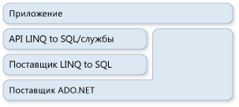

# ADO.NET и LINQ to SQL
[!INCLUDE[vbtecdlinq](../../../../../../includes/vbtecdlinq-md.md)] является частью семейства технологий [!INCLUDE[vstecado](../../../../../../includes/vstecado-md.md)].  Он основан на службах, предоставленных моделью поставщика [!INCLUDE[vstecado](../../../../../../includes/vstecado-md.md)].  Поэтому код [!INCLUDE[vbtecdlinq](../../../../../../includes/vbtecdlinq-md.md)] можно сочетать с существующими приложениями [!INCLUDE[vstecado](../../../../../../includes/vstecado-md.md)] и выполнять переход с текущих решений [!INCLUDE[vstecado](../../../../../../includes/vstecado-md.md)] на [!INCLUDE[vbtecdlinq](../../../../../../includes/vbtecdlinq-md.md)].  На следующем рисунке показано общее представление связи.  
  
   
  
## Подключения  
 При создании <xref:System.Data.Linq.DataContext> [!INCLUDE[vbtecdlinq](../../../../../../includes/vbtecdlinq-md.md)] можно использовать существующее подключение [!INCLUDE[vstecado](../../../../../../includes/vstecado-md.md)].  Оно будет использоваться для выполнения всех операций относительно <xref:System.Data.Linq.DataContext> \(включая запросы\).  Если подключение уже открыто, по завершении работы с ним [!INCLUDE[vbtecdlinq](../../../../../../includes/vbtecdlinq-md.md)] оставит его без изменений.  
  
 [!code-csharp[DLinqCommunicatingWithDatabase#4](../../../../../../samples/snippets/csharp/VS_Snippets_Data/DLinqCommunicatingWithDatabase/cs/Program.cs#4)]
 [!code-vb[DLinqCommunicatingWithDatabase#4](../../../../../../samples/snippets/visualbasic/VS_Snippets_Data/DLinqCommunicatingWithDatabase/vb/Module1.vb#4)]  
  
 Для постоянного доступа к подключению и его закрытия можно использовать свойство <xref:System.Data.Linq.DataContext.Connection%2A>, как показано в следующем коде.  
  
 [!code-csharp[DLinqAdoNet#1](../../../../../../samples/snippets/csharp/VS_Snippets_Data/DLinqAdoNet/cs/Program.cs#1)]
 [!code-vb[DLinqAdoNet#1](../../../../../../samples/snippets/visualbasic/VS_Snippets_Data/DLinqAdoNet/vb/Module1.vb#1)]  
  
## Транзакции  
 Когда приложение уже инициировало транзакцию и в нее требуется включить <xref:System.Data.Linq.DataContext>, его можно добавить в собственную транзакцию базы данных.  
  
 Рекомендуемым методом выполнения транзакций с [!INCLUDE[dnprdnshort](../../../../../../includes/dnprdnshort-md.md)] является использование объекта <xref:System.Transactions.TransactionScope>.  Благодаря этому способу можно выполнить распределенные транзакции, работающие в базах данных и других находящихся в памяти диспетчерах ресурсов.  Для запуска транзакций требуется незначительное количество ресурсов.  Они преобразуются в распределенные транзакции только при наличии в области действия транзакции нескольких подключений.  
  
 [!code-csharp[DLinqAdoNet#2](../../../../../../samples/snippets/csharp/VS_Snippets_Data/DLinqAdoNet/cs/Program.cs#2)]
 [!code-vb[DLinqAdoNet#2](../../../../../../samples/snippets/visualbasic/VS_Snippets_Data/DLinqAdoNet/vb/Module1.vb#2)]  
  
 Этот способ не подходит для всех баз данных.  Например, подключение SqlClient не может повысить уровень системных транзакций, если используется на сервере [!INCLUDE[ss2k](../../../../../../includes/ss2k-md.md)].  Наоборот, оно автоматически включается в полную, распределенную транзакцию при каждом обнаружении используемой области действия транзакции.  
  
## Прямые команды SQL  
 Иногда могут возникать ситуации, когда возможность <xref:System.Data.Linq.DataContext> осуществлять запросы или отправлять изменения будет недостаточной для выполнения специализированной задачи.  В подобных случаях, чтобы запустить команды SQL в базе данных и преобразовать результаты запроса в объекты, можно использовать метод <xref:System.Data.Linq.DataContext.ExecuteQuery%2A>.  
  
 Например, предположим, что данные для класса `Customer` распределены по двум таблицам \(customer1 и customer2\).  Следующий запрос возвращает последовательность двух объектов `Customer`.  
  
 [!code-csharp[DLinqAdoNet#3](../../../../../../samples/snippets/csharp/VS_Snippets_Data/DLinqAdoNet/cs/Program.cs#3)]
 [!code-vb[DLinqAdoNet#3](../../../../../../samples/snippets/visualbasic/VS_Snippets_Data/DLinqAdoNet/vb/Module1.vb#3)]  
  
 Если имена столбцов в табличных результатах соответствуют свойствам столбцов класса сущностей, [!INCLUDE[vbtecdlinq](../../../../../../includes/vbtecdlinq-md.md)] создает объекты вне запроса SQL.  
  
### Параметры  
 Метод <xref:System.Data.Linq.DataContext.ExecuteQuery%2A> допускает использование параметров.  В следующем коде выполняется параметризованный запрос.  
  
 [!code-csharp[DlinqAdoNet#4](../../../../../../samples/snippets/csharp/VS_Snippets_Data/DLinqAdoNet/cs/Program.cs#4)]
 [!code-vb[DlinqAdoNet#4](../../../../../../samples/snippets/visualbasic/VS_Snippets_Data/DLinqAdoNet/vb/Module1.vb#4)]  
  
> [!NOTE]
>  Параметры записываются в тексте запроса с использованием той же нотации с фигурными скобками, что и в методах `Console.WriteLine()` и `String.Format()`.  Метод `String.Format()` принимает указанную строку запроса и заменяет параметры в фигурных скобках на автоматически созданные имена, такие как `@p0`, `@p1`…, `@p(n)`.  
  
## См. также  
 [Дополнительные сведения](../../../../../../docs/framework/data/adonet/sql/linq/background-information.md)   
 [Как повторно использовать соединение между командой ADO.NET и DataContext](../../../../../../docs/framework/data/adonet/sql/linq/how-to-reuse-a-connection-between-an-ado-net-command-and-a-datacontext.md)