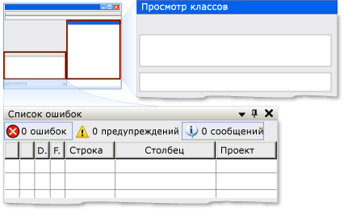

# Implementing the UI Automation Dock Control Pattern
> [!NOTE]
>  Эта документация предназначена для разработчиков .NET Framework, желающих использовать управляемые классы [!INCLUDE[TLA2#tla_uiautomation](../../../includes/tla2sharptla-uiautomation-md.md)], заданные в пространстве имен <xref:System.Windows.Automation>. Последние сведения о [!INCLUDE[TLA2#tla_uiautomation](../../../includes/tla2sharptla-uiautomation-md.md)] см. в разделе [API автоматизации Windows. Автоматизация пользовательского интерфейса](http://go.microsoft.com/fwlink/?LinkID=156746).  
  
 В этом разделе приводятся рекомендации и соглашения для реализации <xref:System.Windows.Automation.Provider.IDockProvider>, включая сведения о свойствах. Ссылки на дополнительные материалы перечислены в конце раздела.  
  
 Шаблон элемента управления <xref:System.Windows.Automation.DockPattern> используется для предоставления свойств закрепления элемента управления в контейнере закрепления. Контейнер закрепления — это элемент управления, который позволяет упорядочить дочерние элементы по горизонтали и по вертикали друг относительно друга. Примеры элементов управления, реализующие данный шаблон элемента управления, см. в разделе [Control Pattern Mapping for UI Automation Clients](../../../docs/framework/ui-automation/control-pattern-mapping-for-ui-automation-clients.md).  
  
   
Пример закрепления из Visual Studio, где окно "Представление классов" — DockPosition.Right, а окно "Список ошибок" — DockPosition.Bottom  
  
   
## Правила и соглашения реализации  
 При реализации шаблона элемента управления Dock обратите внимание на следующие правила и соглашения.  
  
-   <xref:System.Windows.Automation.Provider.IDockProvider> не предоставляет какие\-либо свойства контейнера закрепления или какие\-либо свойства элементов управления, закрепленных рядом с текущим элементом управления в контейнере закрепления.  
  
-   Элементы управления закрепляются относительно друг друга в зависимости от их текущего z\-порядка; чем больше z\-порядок расположения, тем дальше они размещены от заданного края контейнера закрепления.  
  
-   При изменении размеров контейнера закрепления все закрепленные элементы управления в контейнере будут перенесены с выравниванием по тому же краю, к которому они были первоначально прикреплены. Размеры закрепленных элементов управления также будут изменены для заполнения пробелов в контейнере согласно поведению закрепления их <xref:System.Windows.Automation.DockPosition>. Например, если указано <xref:System.Windows.Automation.DockPosition>, левая и правая стороны элемента управления будут расширены для заполнения всего доступного пространства. Если указано <xref:System.Windows.Automation.DockPosition>, все четыре стороны элемента управления будут расширены для заполнения всего доступного пространства.  
  
-   На системах с несколькими мониторами элементы управления должны закрепляться с левой или правой стороны текущего монитора. Если это невозможно, они должны закрепляться с левой стороны крайнего левого монитора или с правой стороны крайнего правого монитора.  
  
   
## Обязательные члены для IDockProvider  
 Следующие свойства и методы обязательны для реализации интерфейса IDockProvider.  
  
|Обязательные члены|Тип члена|Примечания|  
|------------------------|---------------|----------------|  
|<xref:System.Windows.Automation.Provider.IDockProvider.DockPosition%2A>|Свойство|Нет|  
|<xref:System.Windows.Automation.Provider.IDockProvider.SetDockPosition%2A>|Метод|Нет|  
  
 Этот шаблон элемента управления не имеет связанных событий.  
  
   
## Исключения  
 Поставщики должны вызывать следующие исключения.  
  
|Тип исключения|Условие|  
|--------------------|-------------|  
|<xref:System.InvalidOperationException>|<xref:System.Windows.Automation.Provider.IDockProvider.SetDockPosition%2A>   -   Когда элементу управления не удалось выполнить запрошенный стиль закрепления.|  
  
## См. также  
 [UI Automation Control Patterns Overview](../../../docs/framework/ui-automation/ui-automation-control-patterns-overview.md)   
 [Support Control Patterns in a UI Automation Provider](../../../docs/framework/ui-automation/support-control-patterns-in-a-ui-automation-provider.md)   
 [UI Automation Control Patterns for Clients](../../../docs/framework/ui-automation/ui-automation-control-patterns-for-clients.md)   
 [UI Automation Tree Overview](../../../docs/framework/ui-automation/ui-automation-tree-overview.md)   
 [Use Caching in UI Automation](../../../docs/framework/ui-automation/use-caching-in-ui-automation.md)