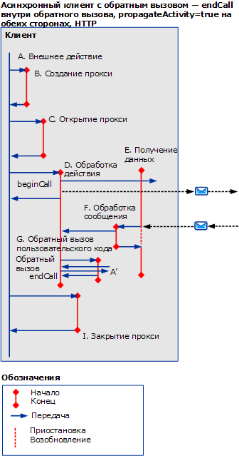

# Асинхронные сценарии с использованием HTTP, TCP или именованного канала
В этом разделе описываются действия и перенаправления для различных асинхронных сценариев типа запрос\-ответ \(с многопотоковыми запросами с использованием HTTP, TCP или именованного канала\).  
  
## Асинхронный запрос\-ответ без ошибок  
 В этом разделе описываются действия и перенаправления для асинхронного сценария типа запрос\-ответ \(с многопотоковым клиентом\).  
  
 Действие вызывающего завершается, когда возвращается значение `beginCall` и `endCall`.При осуществлении обратного вызова возвращается обратный вызов.  
  
 Вызываемое действие завершится, когда возвращается значение `beginCall` и `endCall` или когда возвращается обратный вызов, если он был вызван из данного действия.  
  
### Асинхронный клиент без обратного вызова  
  
#### Распространение включено для обеих сторон \(с использованием HTTP\)  
   
  
 Рис. 1.Асинхронный клиент, без обратного вызова, атрибут `propagateActivity`\=`true` для обеих сторон, с использованием HTTP  
  
 Если атрибут `propagateActivity`\=`true`, действие ProcessMessage указывает, какое действие ProcessAction должно быть передано.  
  
 Для сценариев, основанных на HTTP, для первого отправляемого сообщения вызывается действие ReceiveBytes, которое сохраняется на время существования запроса.  
  
#### Распространение отключено для обеих сторон \(с использованием HTTP\)  
 Если атрибут `propagateActivity`\=`false` для обеих сторон, действие ProcessMessage не указывает, какое действие ProcessAction должно быть передано.Таким образом, вызывается новое временное действие ProcessAction с новым идентификатором.Если асинхронный ответ соответствует запросу в коде ServiceModel, идентификатор действия может быть получен из локального контекста.Фактическое действие ProcessAction может быть передано с данным идентификатором.  
  
   
  
 Рис. 2.Асинхронный клиент, без обратного вызова, атрибут `propagateActivity`\=`false` для любой из сторон, с использованием HTTP  
  
 Для сценариев, основанных на HTTP, для первого отправляемого сообщения вызывается действие ReceiveBytes, которое сохраняется на время существования запроса.  
  
 Действие Process Action создается на асинхронном клиенте, когда атрибут `propagateActivity`\=`false` на стороне вызывающего или вызываемого или когда ответное сообщение не содержит заголовок действия.  
  
#### Распространение включено для обеих сторон \(с использованием TCP или именованного канала\)  
   
  
 Рис. 3.Асинхронный клиент, без обратного вызова, атрибут `propagateActivity`\=`true` для обеих сторон, с использованием именованного канала или TCP  
  
 Для сценария, основанного на именованном канале или TCP, действие ReceiveBytes вызывается при открытии клиента и сохраняется на время существования подключения.  
  
 Аналогично рисунку 1, если атрибут `propagateActivity`\=`true`, действие ProcessMessage указывает, какое действие ProcessAction должно быть передано.  
  
#### Распространение отключено для обеих сторон \(с использованием TCP или именованного канала\)  
 Для сценария, основанного на именованном канале или TCP, действие ReceiveBytes вызывается при открытии клиента и сохраняется на время существования подключения.  
  
 Аналогично рисунку 2, если атрибут `propagateActivity`\=`false` для обеих сторон, действие ProcessMessage не указывает, какое действие ProcessAction должно быть передано.Таким образом, вызывается новое временное действие ProcessAction с новым идентификатором.Если асинхронный ответ соответствует запросу в коде ServiceModel, идентификатор действия может быть получен из локального контекста.Фактическое действие ProcessAction может быть передано с данным идентификатором.  
  
   
  
 Рис. 4.Асинхронный клиент, без обратного вызова, атрибут `propagateActivity`\=`false` для любой из сторон, с использованием именованного канала или TCP  
  
### Асинхронный клиент с обратным вызовом  
 В данном сценарии добавляются действия G и A’ для обратного вызова и `endCall`, а также их передачи в обратном вызове и вне его.  
  
 В этом разделе показано только использование HTTP с атрибутом `propragateActivity`\=`true`.Однако дополнительные действия и передачи также применимы к другим случаям \(а именно `propagateActivity`\=`false`, с использованием TCP или именованного канала\).  
  
 Обратный вызов создает новое действие \(G\), когда клиент вызывает пользовательский код для уведомления о готовности результатов.Затем пользовательский код вызывает `endCall` в обратном вызове \(как показано на рисунке 5\) или вне обратного вызова \(рисунок 6\).Поскольку неизвестно, из какого действия пользователя вызывается `endCall`, это действие помечается буквой `A’`.Действие A’ может быть одинаковым или отличаться от действия A.  
  
   
  
 Рис. 5.Асинхронный клиент с обратным вызовом, `endCall` в обратном вызове  
  
   
  
 Рис. 6.Асинхронный клиент с обратным вызовом, `endCall` вне обратного вызова  
  
### Асинхронный сервер с обратным вызовом  
   
  
 Рис. 7.Асинхронный сервер с обратным вызовом  
  
 Стек каналов выполняет обратный вызов клиента при получении сообщения: трассировки для данной обработки выдаются в самом действии ProcessRequest.  
  
## Асинхронный запрос\-ответ с ошибками  
 Во время `endCall` получаются сообщения об ошибке.В противном случае действия и передачи аналогичны предыдущим сценариям.  
  
## Асинхронная односторонняя связь с ошибками или без них  
 Ответ отсутствует или клиенту возвращается ошибка.