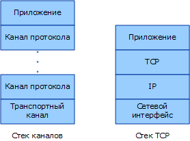
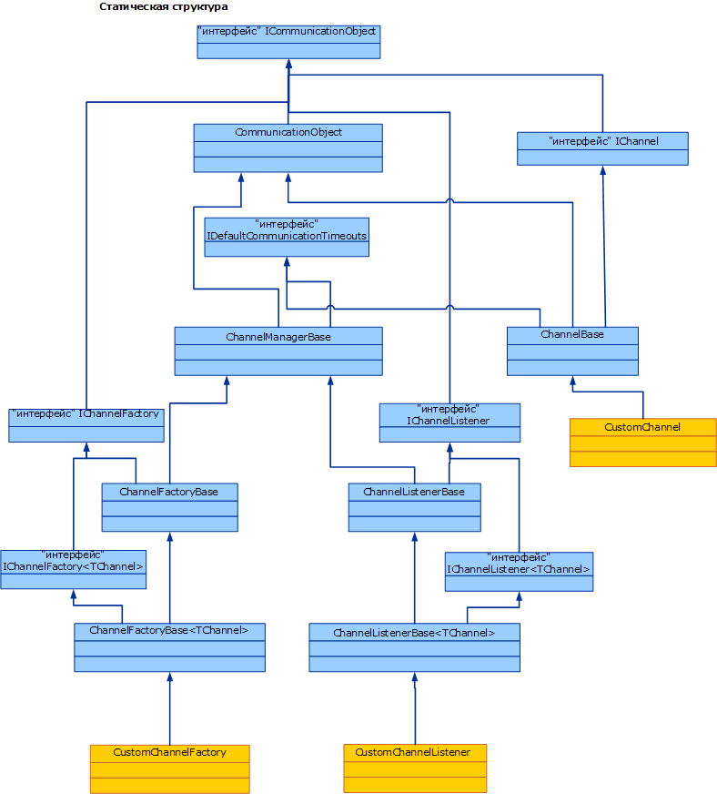

# Общие сведения о модели каналов
Стек канала Windows Communication Foundation (WCF) — это многоуровневый стек связи с одного или нескольких каналов, которые обрабатывают сообщения. В нижней части стека находится канал транспорта, отвечающий за адаптацию стека каналов к используемому транспорту (например, TCP, HTTP, SMTP и другим типам транспорта). Каналы обеспечивают модель низкоуровневого программирования для передачи и приема сообщений. Эта модель программирования основывается на нескольких интерфейсах и ресурсах других типов, в совокупности называемых моделью каналов [!INCLUDE[indigo2](../../../../includes/indigo2-md.md)]. В данном разделе рассматриваются формы каналов, создание базового прослушивателя каналов (в службе) и фабрики каналов (на клиенте).  
  
## Стек каналов  
 Конечные точки [!INCLUDE[indigo2](../../../../includes/indigo2-md.md)] взаимодействуют с внешним миром, используя стек связи, называемый стеком каналов. На следующем рисунке стек каналов сравнивается с другими стеками связи, например TCP/IP.  
  
   
  
 Сначала отметим сходства. В обоих случаях каждый уровень стека обеспечивает некоторое абстрактное представление среды, находящейся под ним, и предоставляет это абстрактное представление только уровню, расположенному непосредственно над ним. Каждый уровень использует абстрактное представление только уровня, расположенного непосредственно под ним. Кроме того, в обоих случаях при взаимодействии двух стеков каждый уровень взаимодействует с соответствующим уровнем другого стека, например уровень IP взаимодействует с уровнем IP, уровень TCP - с уровнем TCP и т. д.  
  
 Теперь отметим различия. Стек TCP был разработан для обеспечения абстрактного представления физической сети, а стек каналов - для обеспечения абстрактного представления не только способа доставки сообщения, т. е. транспорта, но и других особенностей, например содержимого сообщения, протокола, используемого для взаимодействия, включая транспорт, но не только его. Например, элемент привязки надежного сеанса является частью стека каналов, но не находится ниже транспорта и не представляет сам транспорт. Эта абстракция достигается посредством предъявления нижнему каналу в стеке требования адаптировать базовый транспортный протокол к архитектуре стека каналов и последующего расчета на то, что вышестоящие каналы в стеке должны обеспечивать такие функции связи, как предоставление гарантий надежности и безопасности.  
  
 Сообщения проходят через стек связи в виде объектов <xref:System.ServiceModel.Channels.Message>. Как показано на представленном выше рисунке, нижний канал называется каналом транспорта. Этот канал отвечает за передачу сообщений другим участникам и прием сообщений от них, в том числе несет ответственность за преобразование объекта <xref:System.ServiceModel.Channels.Message> в формат, используемый для связи с другими участниками, и за обратное преобразование. Над каналом транспорта может находиться любое число протокольных каналов, каждый из которых отвечает за обеспечение такой функции связи, как предоставление гарантий надежной доставки. Протокольные каналы оперируют с сообщениями, проходящими через них в виде объекта <xref:System.ServiceModel.Channels.Message>. Они обычно либо преобразуют сообщение, например добавляя заголовки или шифруя тело сообщения, либо передают и принимают свои собственные управляющие сообщения протокола, например подтверждения приема.  
  
## Формы каналов  
 Каждый канал реализует один или несколько интерфейсов, называемых интерфейсами форм каналов, или формами каналов. Эти формы каналов обеспечивают такие ориентированные на взаимодействие методы, как передача и прием или запрос и ответ, которые реализуются каналом и вызываются пользователем канала. Основой форм каналов является <xref:System.ServiceModel.Channels.IChannel> интерфейс, который является интерфейсом, который предоставляет `GetProperty` \<T >, предусмотренный в качестве многоуровневого механизма доступа к произвольным возможностям, предоставляемым каналами в стеке. Ниже перечислены пять форм каналов, расширяющих интерфейс <xref:System.ServiceModel.Channels.IChannel>.  
  
-   <xref:System.ServiceModel.Channels.IInputChannel>  
  
-   <xref:System.ServiceModel.Channels.IOutputChannel>  
  
-   <xref:System.ServiceModel.Channels.IRequestChannel>  
  
-   <xref:System.ServiceModel.Channels.IReplyChannel>  
  
-   <xref:System.ServiceModel.Channels.IDuplexChannel>  
  
 Каждая из этих форм имеет эквивалент, который расширяет <xref:System.ServiceModel.Channels.ISessionChannel%601?displayProperty=nameWithType> для поддержки сеансов. Эти особые значения приведены ниже.  
  
-   <xref:System.ServiceModel.Channels.IInputSessionChannel>  
  
-   <xref:System.ServiceModel.Channels.IOutputSessionChannel>  
  
-   <xref:System.ServiceModel.Channels.IRequestSessionChannel>  
  
-   <xref:System.ServiceModel.Channels.IReplySessionChannel>  
  
-   <xref:System.ServiceModel.Channels.IDuplexSessionChannel>  
  
 Формы каналов создаются в соответствии с некоторыми базовыми шаблонами обмена сообщениями, поддерживаемыми существующими транспортными протоколами. Например, односторонний обмен сообщениями соответствует <xref:System.ServiceModel.Channels.IInputChannel> / <xref:System.ServiceModel.Channels.IOutputChannel> пар, запрос ответ соответствует <xref:System.ServiceModel.Channels.IRequestChannel> / <xref:System.ServiceModel.Channels.IReplyChannel> пары и двусторонняя дуплексная связь соответствует <xref:System.ServiceModel.Channels.IDuplexChannel> (которая расширяет формы <xref:System.ServiceModel.Channels.IInputChannel> и <xref:System.ServiceModel.Channels.IOutputChannel>).  
  
## Программирование со стеком каналов  
 Стеки каналов обычно создаются с помощью шаблона фабрики, где привязка создает стек каналов. На стороне передачи привязка используется для создания фабрики <xref:System.ServiceModel.ChannelFactory>, которая, в свою очередь, создает стек каналов и возвращает ссылку на верхний канал в стеке. Затем приложение может использовать этот канал для передачи сообщений. Дополнительные сведения см. в разделе [программирования на уровне канала клиента](../../../../docs/framework/wcf/extending/client-channel-level-programming.md).  
  
 На стороне приема привязка используется для создания прослушивателя <xref:System.ServiceModel.Channels.IChannelListener>, который прослушивает входящие сообщения. <xref:System.ServiceModel.Channels.IChannelListener> предоставляет сообщения прослушивающему приложению, создавая стеки каналов и обрабатывая ссылку приложения на верхний канал. Затем приложение использует этот канал для приема входящих сообщений. Дополнительные сведения см. в разделе [программирования на уровне канала службы](../../../../docs/framework/wcf/extending/service-channel-level-programming.md).  
  
## Объектная модель каналов  
 Объектная модель каналов - это базовый набор интерфейсов, необходимых для реализации каналов, прослушивателей каналов и фабрик каналов. Существуют также некоторые базовые классы, предусмотренные для содействия в обеспечении пользовательских реализаций.  
  
 Прослушиватели каналов отвечают за прослушивание входящих сообщений и их доставку вышестоящему уровню по созданным ими каналам.  
  
 Фабрики каналов отвечают за создание каналов, используемых для передачи сообщений, и за закрытие всех созданных ими каналов, когда эти фабрики закрываются.  
  
 <xref:System.ServiceModel.ICommunicationObject> - это базовый интерфейс, определяющий основной конечный автомат, который реализуют все объекты, обменивающиеся сообщениями. <xref:System.ServiceModel.Channels.CommunicationObject> предоставляет реализацию этого базового интерфейса, от которого можно наследовать другие классы каналов, что позволяет избежать повторной реализации интерфейса. Однако это необязательно: пользовательский канал может реализовать интерфейс <xref:System.ServiceModel.ICommunicationObject> непосредственно, а не наследовать его от <xref:System.ServiceModel.Channels.CommunicationObject>. Ни один из классов, показанных на рис. 3, не считается частью модели каналов; это вспомогательные классы, доступные тем, кто занимается реализацией пользовательских каналов и нуждается в средствах создания каналов.  
  
   
  
 В следующих разделах описываются объектная модель каналов, а также различные области разработки, помогающие создавать пользовательские каналы.  
  
|Раздел|Описание|  
|-----------|-----------------|  
|[Служба: прослушиватели каналов и каналы](../../../../docs/framework/wcf/extending/service-channel-listeners-and-channels.md)|Описываются прослушиватели каналов, ожидающие передачи данных по входящим каналам в приложении службы.|  
|[Клиент: фабрики каналов и каналы](../../../../docs/framework/wcf/extending/client-channel-factories-and-channels.md)|Описываются фабрики каналов, которые создают каналы для подключения к приложению службы.|  
|[Основные сведения об изменении состояния](../../../../docs/framework/wcf/extending/understanding-state-changes.md)|Описывается, как модели интерфейса <xref:System.ServiceModel.ICommunicationObject?displayProperty=nameWithType> изменяют состояния в каналах.|  
|[Выбор схемы обмена сообщениями](../../../../docs/framework/wcf/extending/choosing-a-message-exchange-pattern.md)|Описываются шесть базовых шаблонов обмена сообщениями, которые могут поддерживаться каналами.|  
|[Обработка исключений и сбоев](../../../../docs/framework/wcf/extending/handling-exceptions-and-faults.md)|Описываются способы обработки сбоев и исключений в пользовательских каналах.|  
|[Конфигурация и поддержка метаданных](../../../../docs/framework/wcf/extending/configuration-and-metadata-support.md)|Описываются поддержка использования пользовательских каналов из модели приложения, а также экспорт и импорт метаданных с использованием привязок и элементов привязок.|
