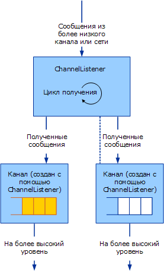

# <a name="service-channel-listeners-and-channels"></a>Служба: Прослушиватели каналов и каналы

Существует три категории объектов каналов: каналы, прослушиватели каналов и фабрик каналов. Каналы - это интерфейс между приложением и стеком канала. Прослушиватели каналов отвечают за создание каналов на принимающей (ожидающей передачи данных) стороне, обычно в ответ на новое входящее сообщение или подключение. Фабрики каналов отвечают за создание каналов на передающей стороне для инициации связи с конечной точкой.

## <a name="channel-listeners-and-channels"></a>Прослушиватели каналов и каналы

Прослушиватели каналов отвечают за создание каналов и прием сообщений с более низкого уровня или из сети. Принятые сообщения доставляются на уровень выше с помощью канала, созданного прослушивателем каналов.

Следующая схема показывает процесс приема сообщения и доставки его на уровень выше.



Прослушиватель каналов принимает сообщения и доставляет их на уровень выше через каналы.

Процесс можно концептуально представить в виде очереди внутри каждого канала, хотя реализация может не использовать очередь. Прослушиватель канала отвечает за прием сообщений с более низкого уровня или из сети и добавление их в очередь. Канал отвечает за получение сообщений из очереди и передачу их на уровень выше, откуда приходит запрос на сообщение, например вызовом команды `Receive` для данного канала.

WCF предоставляет вспомогательные методы базового класса для этого процесса. (Схему вспомогательных классов каналов, обсуждавшиеся в этой статье, см. в разделе [Общие сведения о модели каналов](channel-model-overview.md).)

- <xref:System.ServiceModel.Channels.CommunicationObject> Класс реализует <xref:System.ServiceModel.ICommunicationObject> и принудительно создает конечный автомат, описанный в действии 2 [каналы развивающихся](developing-channels.md).

- <xref:System.ServiceModel.Channels.ChannelManagerBase> Класс реализует <xref:System.ServiceModel.Channels.CommunicationObject> и предоставляет универсальный базовый класс для классов <xref:System.ServiceModel.Channels.ChannelFactoryBase> и <xref:System.ServiceModel.Channels.ChannelListenerBase>. Класс <xref:System.ServiceModel.Channels.ChannelManagerBase> работает совместно с классом <xref:System.ServiceModel.Channels.ChannelBase> - базовым классом, реализующим интерфейс <xref:System.ServiceModel.Channels.IChannel>.

- <xref:System.ServiceModel.Channels.ChannelFactoryBase> Класс реализует <xref:System.ServiceModel.Channels.ChannelManagerBase> и <xref:System.ServiceModel.Channels.IChannelFactory> и объединяет `CreateChannel` перегрузки в одну `OnCreateChannel` абстрактный метод.

- <xref:System.ServiceModel.Channels.ChannelListenerBase> Класс реализует <xref:System.ServiceModel.Channels.IChannelListener>. Он отвечает за базовое управление состоянием.

Следующее обсуждение построено на базе [транспорт: UDP](../../../../docs/framework/wcf/samples/transport-udp.md) образца.

## <a name="creating-a-channel-listener"></a>Создание прослушивателя каналов

`UdpChannelListener` Что в этом примере реализован является производным от <xref:System.ServiceModel.Channels.ChannelListenerBase> класса. Он использует один UDP-сокет для приема датаграмм. Метод `OnOpen` принимает данные через UDP-сокет в асинхронном цикле. Затем данные преобразуются в сообщения с помощью системы кодирования:

```csharp
message = UdpConstants.MessageEncoder.ReadMessage(
  new ArraySegment<byte>(buffer, 0, count),
  bufferManager
);
```

Поскольку один канал датаграмм представляет сообщения, приходящие из нескольких источников, `UdpChannelListener` - одноэлементный прослушиватель. Имеется более одного активного <xref:System.ServiceModel.Channels.IChannel> связан с этим прослушивателем за раз. В образце создается новый экземпляр только в том случае, если канал, возвращенный методом <xref:System.ServiceModel.Channels.ChannelListenerBase%601.AcceptChannel%2A>, был впоследствии освобожден. При получении сообщения, оно ставится в очередь в этот одноэлементный канал.

### <a name="udpinputchannel"></a>UdpInputChannel

`UdpInputChannel` Класс реализует <xref:System.ServiceModel.Channels.IInputChannel>. Он состоит из очереди входящих сообщений, которая заполняется сокетом прослушивателя `UdpChannelListener`. Эти сообщения удаляются из очереди с <xref:System.ServiceModel.Channels.IInputChannel.Receive%2A> метод.
