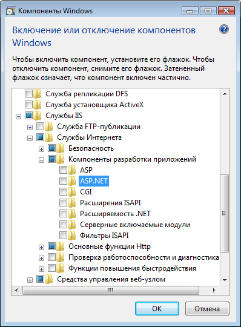

# Настройка IIS 7.0 для Windows Communication Foundation
Службы IIS 7.0 имеют модульную архитектуру, что позволяет выборочно устанавливать необходимые компоненты.Эта архитектура основана на построенной на базе манифестов технологии разбиения на компоненты, появившейся в [!INCLUDE[wv](../../../../includes/wv-md.md)].Имеется более 40 отдельных функциональных компонентов [!INCLUDE[iisver](../../../../includes/iisver-md.md)], которые можно устанавливать независимо друг от друга.Это позволяет ИТ\-специалистам легко настраивать службы в соответствии с конкретными требованиями.В этом разделе описано, как настроить [!INCLUDE[iisver](../../../../includes/iisver-md.md)] на использование [!INCLUDE[indigo1](../../../../includes/indigo1-md.md)] и определить необходимые компоненты.  
  
## Минимальная установка: установка службы WAS  
 Минимальная установка пакета [!INCLUDE[iisver](../../../../includes/iisver-md.md)] предполагает установку службы активации Windows \(WAS\).Служба WAS — это независимый компонент и единственная функция [!INCLUDE[iisver](../../../../includes/iisver-md.md)], доступная во всех версиях операционной системы [!INCLUDE[wv](../../../../includes/wv-md.md)] \(Home Basic, Home Premium, Business, Ultimate и Enterprise\).  
  
 В панели управления нажмите **Программы**, после чего нажмите **Включение или отключение компонентов Windows** в разделе **Программы и компоненты**; компоненты WAS появится в списке, как показано на следующем рисунке.  
  
   
  
 Этот компонент включает следующие подкомпоненты:  
  
-   Среда .NET Environment  
  
-   Интерфейсы API настройки  
  
-   Модель процессов  
  
 Если выбрать корневой узел WAS, по умолчанию будет выбран только компонент **Модель процессов**.Обратите внимание, что при такой установке устанавливается только служба WAS, поскольку поддержка веб\-сервера отсутствует.  
  
 Чтобы работали приложения [!INCLUDE[indigo2](../../../../includes/indigo2-md.md)] или [!INCLUDE[vstecasp](../../../../includes/vstecasp-md.md)], установите флажок **Среда .NET Environment**.Это означает, что для правильной работы [!INCLUDE[indigo2](../../../../includes/indigo2-md.md)] и [!INCLUDE[vstecasp](../../../../includes/vstecasp-md.md)] требуются все компоненты WAS.Они автоматически выбираются при установке какого либо из этих компонентов.  
  
## Службы IIS 7.0: установка по умолчанию  
 При выборе компонента **Службы IIS** автоматически выбираются некоторые подкомпоненты, как показано на следующем рисунке.  
  
   
  
 Это установка [!INCLUDE[iisver](../../../../includes/iisver-md.md)] по умолчанию.Такая установка позволяет использовать службы [!INCLUDE[iisver](../../../../includes/iisver-md.md)] для работы со статическим содержимым \(например, со страницами HTML и другим содержимым\).Однако она не позволяет выполнять приложения [!INCLUDE[vstecasp](../../../../includes/vstecasp-md.md)] или CGI или размещать службы [!INCLUDE[indigo2](../../../../includes/indigo2-md.md)].  
  
## IIS 7.0: установка с поддержкой ASP.NET  
 Чтобы в службах IIS 7.0 работала поддержка [!INCLUDE[vstecasp](../../../../includes/vstecasp-md.md)], необходимо установить [!INCLUDE[vstecasp](../../../../includes/vstecasp-md.md)].При установке флажка **ASP.NET** экран будет выглядеть следующим образом.  
  
   
  
 Это минимальная среда, необходимая для работы приложений [!INCLUDE[indigo2](../../../../includes/indigo2-md.md)] и [!INCLUDE[vstecasp](../../../../includes/vstecasp-md.md)] со службами [!INCLUDE[iisver](../../../../includes/iisver-md.md)].  
  
## IIS 7.0: установка с компонентами совместимости с IIS 6.0  
 При установке служб [!INCLUDE[iisver](../../../../includes/iisver-md.md)] в системе с Visual Studio 2005 или некоторыми другими средствами или скриптами автоматизации \(например, Adsutil.vbs\), которые настраивают виртуальные приложения, использующие API метабазы [!INCLUDE[iis601](../../../../includes/iis601-md.md)], проверьте, что установлен флажок **Инструменты для работы со скриптами**[!INCLUDE[iis601](../../../../includes/iis601-md.md)].При этом будут автоматически выбраны другие компоненты узла **Совместимость узла**[!INCLUDE[iis601](../../../../includes/iis601-md.md)].На следующем рисунке показан экран, соответствующий этой ситуации.  
  
   
  
 При такой установке имеется все, что необходимо для использования компонентов [!INCLUDE[iisver](../../../../includes/iisver-md.md)], [!INCLUDE[vstecasp](../../../../includes/vstecasp-md.md)] и [!INCLUDE[indigo2](../../../../includes/indigo2-md.md)], а также доступные в Интернете образцы.  
  
## Ограничения запросов  
 В [!INCLUDE[wv](../../../../includes/wv-md.md)] со службами IIS 7 были изменены значения по умолчанию для параметров `maxUri` и `maxQueryStringSize`.По умолчанию фильтрация запросов в IIS 7.0 допускает использование URL\-адресов длиной 4096 знаков и строк запросов длиной 2048 знаков.Чтобы изменить эти значения по умолчанию, добавьте в файл App.config следующий XML\-код.  
  
 `<system.webServer>`  
  
 `<security>`  
  
 `<requestFiltering>`  
  
 `<requestLimits maxUrl=”8192” maxQueryString=”8192” />`  
  
 `</requestFiltering>`  
  
 `</security>`  
  
 `</system.webServer>`  
  
## См. также  
 [Архитектура активации WAS](../../../../docs/framework/wcf/feature-details/was-activation-architecture.md)   
 [Настройка WAS для использования с WCF](../../../../docs/framework/wcf/feature-details/configuring-the-wpa--service-for-use-with-wcf.md)   
 [Как устанавливать и настраивать компоненты активации WCF](../../../../docs/framework/wcf/feature-details/how-to-install-and-configure-wcf-activation-components.md)   
 [Функции размещения Windows Server App Fabric](http://go.microsoft.com/fwlink/?LinkId=201276)