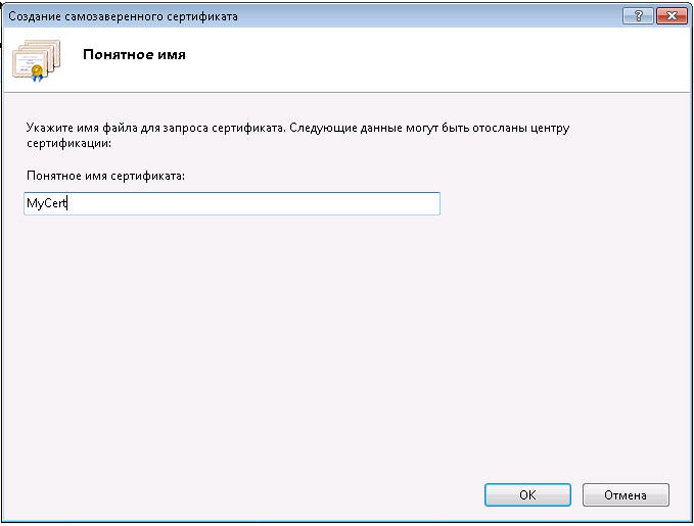
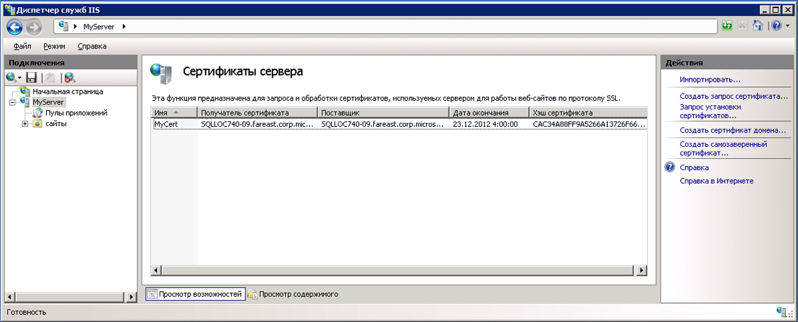
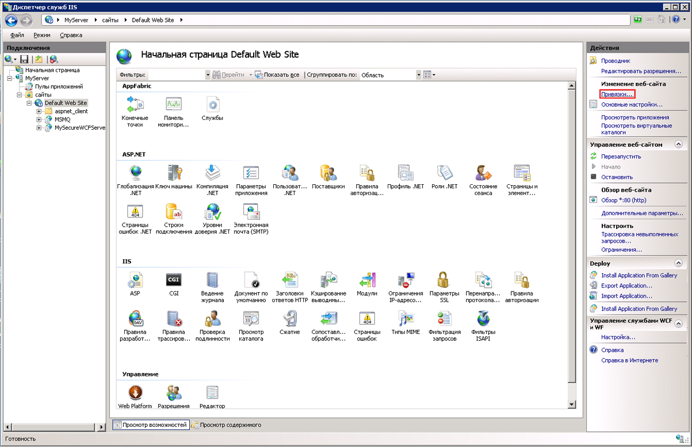
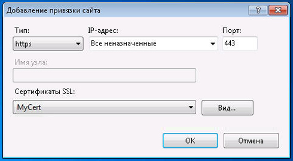
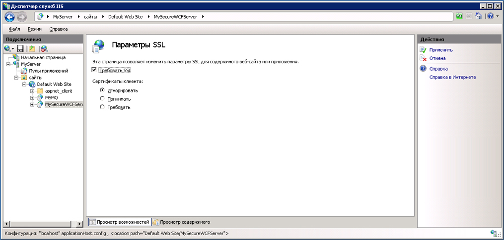

# Как настраивать протокол SSL в службе WCF, размещенной в IIS
В этом разделе описано, как настроить размещенную в IIS службу WCF для использования безопасности транспорта HTTP.  Для безопасности транспорта HTTP требуется, чтобы SSL\-сертификат был зарегистрирован в службах IIS.  Если SSL\-сертификат не установлен, для создания тестового сертификата можно использовать службы IIS.  Затем необходимо добавить SSL\-привязку для проекта веб\-сайта и установить свойства проверки подлинности веб\-сайта.  Наконец, необходимо настроить службу WCF на использование протокола HTTPS.  
  
### Создание самозаверяющего сертификата  
  
1.  Откройте диспетчер служб IIS \(inetmgr.exe\) и выберите имя компьютера в левой части представления в виде дерева.  В правой части экрана выберите сертификаты сервера  
  
       
  
2.  В окне сертификатов сервера щелкните **Создание самозаверяющего сертификата…** Связь.  
  
       
  
3.  Введите понятное имя для самозаверяющего сертификата и нажмите кнопку **ОК**.  
  
       
  
     Сведения о вновь созданном самозаверяющем сертификате теперь отображаются в окне **Сертификаты сервера**.  
  
       
  
     Созданный сертификат устанавливается в хранилище доверенных корневых центров сертификации.  
  
### Добавление привязки SSL  
  
1.  В диспетчере служб IIS разверните папку **Сайты**, затем папку **Веб\-сайт по умолчанию** в представлении в виде дерева в левой части экрана.  
  
2.  Щелкните **Привязки…** Ссылка в области **Действия** в правой верхней части окна.  
  
       
  
3.  В окне «Привязки сайта» нажмите кнопку **Добавить**.  
  
       
  
4.  В диалоговом окне **Добавление привязки сайта** выберите HTTPS в качестве типа и укажите понятное имя самозаверяющего сертификата, созданного на предыдущих этапах.  
  
       
  
### Настройка виртуального каталога для SSL  
  
1.  В диспетчере служб IIS выберите виртуальный каталог, содержащий безопасную службу WCF.  
  
2.  На центральной панели окна выберите **Параметры SSL** в разделе IIS.  
  
       
  
3.  На панели параметров SSL установите флажок **Требовать SSL** и щелкните ссылку **Применить** в разделе **Действия** в правой части экрана.  
  
       
  
### Настройка службы WCF для безопасности транспорта HTTP  
  
1.  В файле web.config службы WCF настройте привязку HTTP на использование безопасности транспорта, как показано в следующем фрагменте XML.  
  
    ```  
    <bindings>  
          <basicHttpBinding>  
            <binding name="secureHttpBinding">  
              <security mode="Transport">  
                <transport clientCredentialType="None"/>  
              </security>  
            </binding>  
          </basicHttpBinding>  
        </bindings>  
  
    ```  
  
2.  Укажите службу и конечную точку службы, как показано в следующем фрагменте XML.  
  
    ```  
    <services>  
          <service name="MySecureWCFService.Service1">  
            <endpoint address=""  
                      binding="basicHttpBinding"  
                      bindingConfiguration="secureHttpBinding"  
                      contract="MySecureWCFService.IService1"/>  
  
            <endpoint address="mex"  
                      binding="mexHttpsBinding"  
                      contract="IMetadataExchange" />  
          </service>  
        </services>  
  
    ```  
  
## Пример  
 Ниже приведен полный пример файла web.config для службы WCF, использующей безопасность транспорта HTTP  
  
```  
<?xml version="1.0"?>  
<configuration>  
  
  <system.web>  
    <compilation debug="true" targetFramework="4.0" />  
  </system.web>  
  <system.serviceModel>  
    <services>  
      <service name="MySecureWCFService.Service1">  
        <endpoint address=""  
                  binding="basicHttpBinding"  
                  bindingConfiguration="secureHttpBinding"  
                  contract="MySecureWCFService.IService1"/>  
  
        <endpoint address="mex"  
                  binding="mexHttpsBinding"  
                  contract="IMetadataExchange" />  
      </service>  
    </services>  
    <bindings>  
      <basicHttpBinding>  
        <binding name="secureHttpBinding">  
          <security mode="Transport">  
            <transport clientCredentialType="None"/>  
          </security>  
        </binding>  
      </basicHttpBinding>  
    </bindings>  
    <behaviors>  
      <serviceBehaviors>  
        <behavior>  
          <!-- To avoid disclosing metadata information, set the value below to false and remove the metadata endpoint above before deployment -->  
          <serviceMetadata httpsGetEnabled="true"/>  
          <!-- To receive exception details in faults for debugging purposes, set the value below to true.  Set to false before deployment to avoid disclosing exception information -->  
          <serviceDebug includeExceptionDetailInFaults="false"/>  
        </behavior>  
      </serviceBehaviors>  
    </behaviors>  
    <serviceHostingEnvironment multipleSiteBindingsEnabled="true" />  
  </system.serviceModel>  
 <system.webServer>  
    <modules runAllManagedModulesForAllRequests="true"/>  
  </system.webServer>  
  
</configuration>  
  
```  
  
<!-- TODO: review snippet reference  [!CODE [Microsoft.Win32.RegistryKey#4](Microsoft.Win32.RegistryKey#4)]  -->  
  
## См. также  
 [Размещение в службах IIS](../../../../docs/framework/wcf/feature-details/hosting-in-internet-information-services.md)   
 [Инструкции по размещению в службах IIS](../../../../docs/framework/wcf/samples/internet-information-service-hosting-instructions.md)   
 [Рекомендации по размещению в службах IIS](../../../../docs/framework/wcf/feature-details/internet-information-services-hosting-best-practices.md)   
 [Размещение в службах IIS с использованием встроенного кода](../../../../docs/framework/wcf/samples/iis-hosting-using-inline-code.md)