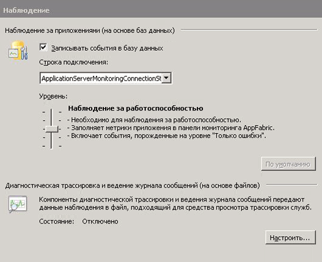

# Как разместить службу рабочего процесса с помощью Windows Server App Fabric
Размещение служб рабочих процессов в фабрике приложений аналогично их размещению в виртуальном каталоге служб IIS\/WAS.Разница состоит лишь в предоставлении фабрикой приложений средств для развертывания, наблюдения и управления службами рабочих процессов.В этом разделе используется служба рабочих процессов, созданная в разделе [Создание службы долго выполняющегося рабочего процесса](../../../../docs/framework/wcf/feature-details/creating-a-long-running-workflow-service.md).Указанный раздел содержит пошаговые инструкции по созданию службы рабочих процессов.В этом разделе объясняется, как разместить службу рабочих процессов с помощью фабрики приложений.[!INCLUDE[crabout](../../../../includes/crabout-md.md)]Дополнительные сведения о фабрике приложений Windows Server см. в [Документации по фабрике приложений Windows Server](http://go.microsoft.com/fwlink/?LinkID=193037&clcid=0x409)Перед выполнением описанных далее шагов убедитесь, что фабрика приложений Windows Server уже установлена.Для этого откройте диспетчер служб IIS \(inetmgr.exe\), щелкните имя нужного сервера в представлении **Соединения**, щелкните узел «Веб\-сайты», а затем узел **Веб\-сайт по умолчанию**.В правой части экрана должен находиться раздел с названием **Фабрика приложений**.Если вы не видите этот раздел \(он находится в верхней правой панели\), значит фабрика приложений не установлена.[!INCLUDE[crabout](../../../../includes/crabout-md.md)] фабрике приложений Windows Server см. в [Документации по фабрике приложений Windows Server](http://go.microsoft.com/fwlink/?LinkId=193136).  
  
### Создание простой службы рабочих процессов  
  
1.  Откройте среду [!INCLUDE[vs_current_long](../../../../includes/vs-current-long-md.md)] и загрузите решение OrderProcessing, созданное в разделе [Создание службы долго выполняющегося рабочего процесса](../../../../docs/framework/wcf/feature-details/creating-a-long-running-workflow-service.md).  
  
2.  Щелкните правой кнопкой мыши проект **OrderService**, выберите пункт **Свойства** и перейдите на вкладку **Веб**.  
  
3.  В разделе **Действие при запуске** на этой странице свойств выберите вариант **Указанная страница** и введите в поле ввода значение Service1.xamlx.  
  
4.  В разделе **Серверы** на этой странице свойств выберите вариант **Использовать локальный веб\-сервер IIS** и введите следующий URL\-адрес: `http://localhost/OrderService`.  
  
5.  Нажмите кнопку **Создать виртуальный каталог**.При этом будет создан новый виртуальный каталог, а проект будет настроен для копирования необходимых файлов в этот каталог при сборке проекта.Можно также вручную скопировать в этот виртуальный каталог XAMLX\-файл, файл web.config и все необходимые библиотеки DLL.  
  
### Настройка службы рабочих процессов, размещенной в фабрике приложений Windows Server  
  
1.  Откройте диспетчер служб IIS \(inetmgr.exe\).  
  
2.  Перейдите в виртуальный каталог OrderService в области **Соединения**.  
  
3.  Щелкните правой кнопкой мыши OrderService и выберите элементы **Управление службами WCF и WF**, **Настроить…**Откроется диалоговое окно **Настройка WCF и WF для приложения**.  
  
4.  Перейдите на вкладку **Общие**, содержащую общие сведения о приложении, показанные на следующем снимке экрана.  
  
       
  
5.  Перейдите на вкладку **Наблюдение**.Здесь показаны различные параметры наблюдения, как показано на следующем снимке экрана.  
  
       
  
     [!INCLUDE[crabout](../../../../includes/crabout-md.md)] настройке мониторинга служб рабочих процессов в фабрике приложений см. в разделе [Настройка наблюдения при работе с фабрикой приложений](http://go.microsoft.com/fwlink/?LinkId=193153).  
  
6.  Перейдите на вкладку **Сохранение рабочих процессов**.Здесь можно настроить приложение для использования поставщика механизма сохраняемости по умолчанию фабрикой приложений, как показано на следующем снимке экрана.  
  
       
  
     [!INCLUDE[crabout](../../../../includes/crabout-md.md)] настройке сохранения служб рабочих процессов в фабрике приложений Windows Server см. в разделе [Настройка сохранения рабочих процессов в фабрике приложений](http://go.microsoft.com/fwlink/?LinkId=193148).  
  
7.  Перейдите на вкладку **Управление размещением рабочих процессов**.Здесь можно указать, когда должны выгружаться и сохраняться бездействующие службы рабочих процессов, как показано на следующем снимке экрана.  
  
       
  
     [!INCLUDE[crabout](../../../../includes/crabout-md.md)] настройке узла размещения рабочих процессов см. в разделе [Настройка узла размещения рабочих процессов в фабрике приложений](http://go.microsoft.com/fwlink/?LinkId=193151).  
  
8.  Перейдите на вкладку **Автозапуск**.Здесь можно указать параметры автозапуска служб рабочих процессов в приложении, как показано на следующем снимке экрана.  
  
       
  
     [!INCLUDE[crabout](../../../../includes/crabout-md.md)] автозапуске см. в разделе [Настройка автозапуска при работе с фабрикой приложений](http://go.microsoft.com/fwlink/?LinkId=193150).  
  
9. Перейдите на вкладку **Регулирование**.Здесь можно настроить параметры регулирования для службы рабочих процессов, как показано на следующем снимке экрана.  
  
       
  
     [!INCLUDE[crabout](../../../../includes/crabout-md.md)] настройке регулирования см. в разделе [Настройка регулирования при работе с фабрикой приложений](http://go.microsoft.com/fwlink/?LinkId=193149).  
  
10. Перейдите на вкладку **Безопасность**.Здесь можно настроить параметры безопасности для приложения, как показано на следующем снимке экрана.  
  
       
  
     [!INCLUDE[crabout](../../../../includes/crabout-md.md)] настройке безопасности при работе с фабрикой приложений Windows Server см. в разделе [Настройка безопасности при работе с фабрикой приложений](http://go.microsoft.com/fwlink/?LinkId=193152).  
  
### Использование фабрики приложений Windows Server  
  
1.  Выполните построение решения, чтобы скопировать необходимые файлы в виртуальный каталог.  
  
2.  Щелкните правой кнопкой мыши проект OrderClient и выберите пункты **Отладка** и **Запустить новый экземпляр**, чтобы запустить клиентское приложение.  
  
3.  При этом будет запущен клиент, а среда Visual Studio отобразит диалоговое окно **Предупреждение системы безопасности о присоединении**. Нажмите кнопку **Не присоединять**.При этом среда Visual Studio не будет присоединяться к процессу служб IIS для отладки.  
  
4.  Клиентское приложение немедленно вызовет службу рабочих процессов и перейдет в состояние ожидания.Служба рабочих процессов перейдет в состояние бездействия и будет сохранена.Чтобы это проверить, запустите диспетчер служб IIS \(inetmgr.exe\), перейдите к элементу OrderService в области «Соединения» и выберите его.Затем щелкните значок панели мониторинга фабрики приложений на панели справа.В разделе «Сохраненные экземпляры WF» можно видеть один сохраненный экземпляр службы рабочих процессов, как показано на следующем снимке экрана.  
  
       
  
     В области **Журнал экземпляра WF** приведены сведения о службе рабочих процессов, такие как число ее активаций, число завершений экземпляров службы, а также число экземпляров рабочих процессов со сбоями.Под активными и бездействующими экземплярами отображается ссылка, перейдя по которой можно просмотреть дополнительные сведения о бездействующих экземплярах рабочих процессов, как показано на следующем снимке экрана.  
  
       
  
     Дополнительные сведения о функциях фабрики приложений Windows Server и методах их использования см. в разделе [Функции размещения фабрики приложений Windows Server](http://go.microsoft.com/fwlink/?LinkID=193143&clcid=0x409).  
  
## См. также  
 [Создание службы долго выполняющегося рабочего процесса](../../../../docs/framework/wcf/feature-details/creating-a-long-running-workflow-service.md)   
 [Функции размещения фабрики приложений Windows Server](http://go.microsoft.com/fwlink/?LinkId=193143)   
 [Установка фабрики приложений Windows Server](http://go.microsoft.com/fwlink/?LinkId=193136)   
 [Документация по фабрике приложений Windows Server](http://go.microsoft.com/fwlink/?LinkID=193037&clcid=0x419)