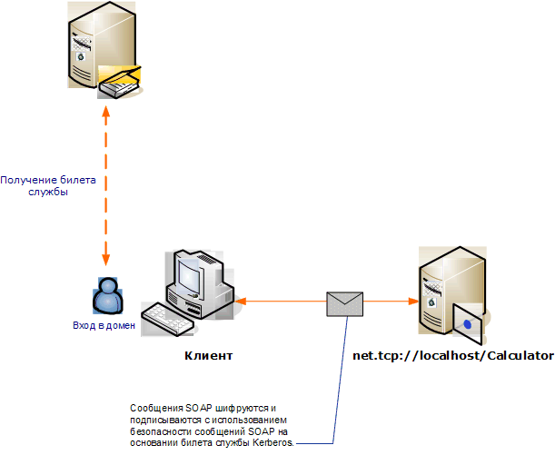

# <a name="message-security-with-a-windows-client-without-credential-negotiation"></a>Безопасность сообщений с использованием клиента Windows без согласования учетных данных
В следующем сценарии показаны клиент Windows Communication Foundation (WCF) и служба, защищенные протоколом Kerberos.  
  
 Клиент и служба находятся в одном и том же домене или в доверенных доменах.  
  
> [!NOTE]
>  Разница между этот сценарий и [безопасность сообщений с клиентом Windows](../../../../docs/framework/wcf/feature-details/message-security-with-a-windows-client.md) является этот сценарий не выполняет согласование учетных данных службы с помощью службы перед отправкой сообщения приложения. И так как для этого требуется протокол Kerberos, для этого сценария необходима среда домена Windows.  
  
   
  
|Характеристика|Описание|  
|--------------------|-----------------|  
|Режим безопасности|Сообщение|  
|Взаимодействие|Да, WS-Security с клиентами, совместимыми с профилем маркера Kerberos|  
|Проверка подлинности (сервера)|Взаимная проверка подлинности сервера и клиента|  
|Проверка подлинности (клиента)|Взаимная проверка подлинности сервера и клиента|  
|Целостность|Да|  
|Конфиденциальность|Да|  
|Transport|HTTP|  
|Привязка|<xref:System.ServiceModel.WSHttpBinding>|  
  
## <a name="service"></a>Служба  
 Предполагается, что представленные ниже код и конфигурация выполняются независимо. Выполните одно из следующих действий.  
  
-   Создайте автономную службу, используя код без конфигурации.  
  
-   Создайте службу, используя предоставленную конфигурацию, но не определяйте конечные точки.  
  
### <a name="code"></a>Код  
 В следующем коде создается конечная точка службы, которая использует безопасность сообщений. Этот код отключает согласование учетных данных службы и установку маркера контекста безопасности (SCT).  
  
> [!NOTE]
>  Для использования типа учетных данных Windows без согласования учетная запись пользователя службы должна иметь доступ к имени участника-службы (SPN), зарегистрированному с доменом Active Directory. Для этого существуют два способа:  
  
1.  Используйте учетную запись `NetworkService` или `LocalSystem` для запуска службы. Так как эти учетные записи имеют доступ к SPN компьютера, заданный при присоединении компьютера к домену Active Directory, WCF автоматически создает соответствующий элемент SPN внутри конечной точки службы в метаданных службы (Web Services описание Язык или WSDL).  
  
2.  Запустите службу из любой учетной записи домена Active Directory. В этом случае потребуется установить SPN для учетной записи домена. Это можно сделать, например, с помощью средства Setspn.exe. Создав SPN для учетной записи службы, настройте WCF публиковать это SPN в клиентах службы через метаданные (WSDL). Это можно сделать, настроив удостоверение конечной точки для предоставляемой конечной точки либо в файле конфигурации приложения, либо в коде. В следующем примере описывается программный способ публикации удостоверения.  
  
 Дополнительные сведения об именах SPN, протокол Kerberos и Active Directory см. в разделе [техническое дополнение Kerberos для Windows](http://go.microsoft.com/fwlink/?LinkId=88330). Дополнительные сведения об удостоверениях конечной точки см. в разделе [режимы проверки подлинности SecurityBindingElement](../../../../docs/framework/wcf/feature-details/securitybindingelement-authentication-modes.md).  
  
 [!code-csharp[C_SecurityScenarios#12](../../../../samples/snippets/csharp/VS_Snippets_CFX/c_securityscenarios/cs/source.cs#12)]
 [!code-vb[C_SecurityScenarios#12](../../../../samples/snippets/visualbasic/VS_Snippets_CFX/c_securityscenarios/vb/source.vb#12)]  
  
### <a name="configuration"></a>Конфигурация  
 Вместо кода можно использовать следующую конфигурацию.  
  
```xml  
<?xml version="1.0" encoding="utf-8"?>  
<configuration>  
  <system.serviceModel>  
    <behaviors />  
    <services>  
      <service behaviorConfiguration="" name="ServiceModel.Calculator">  
        <endpoint address="http://localhost/Calculator"   
                  binding="wsHttpBinding"  
                  bindingConfiguration="KerberosBinding"  
                  name="WSHttpBinding_ICalculator"  
                  contract="ServiceModel.ICalculator"   
                  listenUri="net.tcp://localhost/metadata" >  
         <identity>  
            <servicePrincipalName value="service_spn_name" />  
         </identity>  
        </endpoint>  
      </service>  
    </services>  
    <bindings>  
      <wsHttpBinding>  
        <binding name="KerberosBinding">  
          <security>  
            <message negotiateServiceCredential="false"   
                     establishSecurityContext="false" />  
          </security>  
        </binding>  
      </wsHttpBinding>  
    </bindings>  
    <client />  
  </system.serviceModel>  
</configuration>  
```  
  
## <a name="client"></a>Клиент  
 Предполагается, что представленные ниже код и конфигурация выполняются независимо. Выполните одно из следующих действий.  
  
-   Создайте автономный клиент, используя код (и код клиента).  
  
-   Создайте клиент, который не определяет никаких адресов конечных точек. Вместо этого используйте конструктор клиента, который принимает в качестве аргумента имя конфигурации. Например:  
  
     [!code-csharp[C_SecurityScenarios#0](../../../../samples/snippets/csharp/VS_Snippets_CFX/c_securityscenarios/cs/source.cs#0)]
     [!code-vb[C_SecurityScenarios#0](../../../../samples/snippets/visualbasic/VS_Snippets_CFX/c_securityscenarios/vb/source.vb#0)]  
  
### <a name="code"></a>Код  
 Следующий код служит для настройки клиента. Для режима безопасности задано значение Message, типу учетных данных клиента присвоено значение Windows. Обратите внимание: свойствам <xref:System.ServiceModel.MessageSecurityOverHttp.NegotiateServiceCredential%2A> и <xref:System.ServiceModel.NonDualMessageSecurityOverHttp.EstablishSecurityContext%2A> задается значение `false`.  
  
> [!NOTE]
>  Для использования типа учетных данных Windows без согласования требуется настроить SPN учетной записи службы до начала обмена данными со службой. Клиент использует имя SPN, чтобы получить маркер Kerberos для проверки подлинности и обеспечения безопасности обмена данными со службой. В следующем образце показано, как настроить SPN службы для клиента. Если вы используете [ServiceModel Metadata Utility Tool (Svcutil.exe)](../../../../docs/framework/wcf/servicemodel-metadata-utility-tool-svcutil-exe.md) для создания клиента, имя участника-службы для службы автоматически распространяется на клиент из метаданных службы (WSDL), если содержит метаданные службы Эти сведения. Дополнительные сведения о настройке службы для включения имени участника-службы в метаданных службы см. в разделе «Служба» далее в этом разделе.  
>   
>  Дополнительные сведения о имена участников-служб, Kerberos и Active Directory см. в разделе [техническое дополнение Kerberos для Windows](http://go.microsoft.com/fwlink/?LinkId=88330). Дополнительные сведения об удостоверениях конечной точки см. в разделе [режимы проверки подлинности SecurityBindingElement](../../../../docs/framework/wcf/feature-details/securitybindingelement-authentication-modes.md) раздела.  
  
 [!code-csharp[C_SecurityScenarios#19](../../../../samples/snippets/csharp/VS_Snippets_CFX/c_securityscenarios/cs/source.cs#19)]
 [!code-vb[C_SecurityScenarios#19](../../../../samples/snippets/visualbasic/VS_Snippets_CFX/c_securityscenarios/vb/source.vb#19)]  
  
### <a name="configuration"></a>Конфигурация  
 Следующий код служит для настройки клиента. Обратите внимание, что [ \<servicePrincipalName >](../../../../docs/framework/configure-apps/file-schema/wcf/serviceprincipalname.md) элемент должен иметь значение для сопоставления имени участника-службы для службы, зарегистрированное для учетной записи службы в домене Active Directory.  
  
```xml  
<?xml version="1.0" encoding="utf-8"?>  
<configuration>  
  <system.serviceModel>  
    <bindings>  
      <wsHttpBinding>  
        <binding name="WSHttpBinding_ICalculator" >  
          <security mode="Message">  
            <message clientCredentialType="Windows"   
                     negotiateServiceCredential="false"  
                     establishSecurityContext="false" />  
          </security>  
        </binding>  
      </wsHttpBinding>  
    </bindings>  
    <client>  
      <endpoint address="http://localhost/Calculator"   
                binding="wsHttpBinding"  
                bindingConfiguration="WSHttpBinding_ICalculator"  
                contract="ICalculator"  
                name="WSHttpBinding_ICalculator">  
        <identity>  
          <servicePrincipalName value="service_spn_name" />  
        </identity>  
      </endpoint>  
    </client>  
  </system.serviceModel>  
</configuration>  
```  
  
## <a name="see-also"></a>См. также  
 [Общие сведения о безопасности](../../../../docs/framework/wcf/feature-details/security-overview.md)  
 [Идентификация и проверка подлинности службы](../../../../docs/framework/wcf/feature-details/service-identity-and-authentication.md)  
 [Модель безопасности для Windows Server App Fabric](http://go.microsoft.com/fwlink/?LinkID=201279&clcid=0x409)
