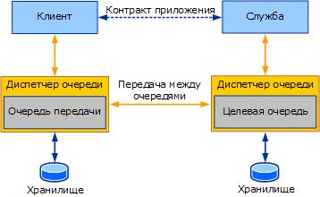
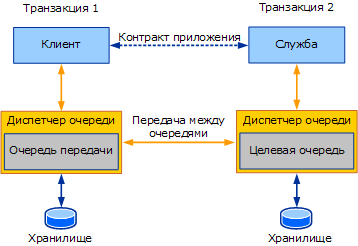

# Общие сведения об очередях
В этом разделе описаны общие и основные принципы, лежащие в основе взаимодействия с использованием очередей. В последующих подразделах сведения о том, как описанные здесь принципы очередей объявленное в Windows Communication Foundation (WCF).  
  
## Основные принципы очередей  
 При разработке распределенного приложения важно выбрать правильный транспорт для связи между службами и клиентами. Выбор транспорта определяется несколькими факторами. Во-первых, выбор между транспортом очередей или прямым транспортом (как TCP или HTTP) определяется изоляцией между службой, клиентом и транспортом. Особенностью прямых транспортов, таких как TCP или HTTP, является то, что связь останавливается при прекращении функционирования службы или клиента или сбое сети. Приложение работает, только если служба, клиент и сеть выполняются одновременно. Транспорты очереди обеспечивают изоляцию, т. е. при сбое службы, клиента или каналов связи между ними клиент и служба могут продолжать функционировать.  
  
 Очереди обеспечивают надежную связь даже в случае сбоя участников взаимодействия или неполадок в сети. Очереди перенаправляют и доставляют сообщения, которыми обмениваются участники взаимодействия. Как правило, очереди содержатся в хранилище, которое может быть неустойчивым и постоянным. Очереди хранят сообщения от клиента от имени службы, а затем переадресовывают эти сообщения службе. Очереди с косвенным обращением обеспечивают гарантированную изоляцию от сбоев любого участника взаимодействия и поэтому являются предпочтительным механизмом связи в системах высокой доступности и отключенных службах. Косвенное обращение обеспечивается ценой высокой задержки. *Задержка* это промежуток времени между моментом времени, клиент отправляет сообщение и времени, служба получает его. Это означает, что после отправки сообщения пользователь не знает, когда сообщение будет обработано. Большинство приложений с очередями справляются с высокой задержкой. Следующая иллюстрация представляет концептуальную модель взаимодействия с использованием очередей.  
  
   
  
 Концептуальная модель взаимодействия с использованием очередей  
  
 На практике очередь функционирует по принципу распределенности. Очереди могут быть локальными для любого участника взаимодействия или удаленными для обоих участников. Как правило, очередь является локальной для службы. В этом случае клиент не может рассчитывать на постоянную доступность подключения к удаленной очереди. Аналогично, очередь должна быть доступной независимо от того, доступна ли служба, выполняющая чтение из очереди. Диспетчер очередей управляет коллекцией очередей. Он несет ответственность за прием сообщений, отправленных в его очереди из других диспетчеров очередей. Также на диспетчера очередей возлагается ответственность за управление возможностью подключения к удаленным очередям и передачу сообщений этим удаленным очередям. Чтобы обеспечить доступность очередей независимо от сбоев клиентского приложения или приложения служб, диспетчер очередей, как правило, выполняется как внешняя служба.  
  
 Когда клиент отправляет сообщение в очередь, он адресует сообщение целевой очереди, т. е. очереди, управляемой диспетчером очередей службы. Диспетчер очередей на стороне клиента отправляет сообщение в очередь передачи (очередь исходящих сообщений). Очередь передачи - это очередь в диспетчере очередей клиента, которая хранит сообщения для передачи целевой очереди. Затем диспетчер очередей находит путь к диспетчеру очередей, владеющему целевой очередью, и передает ему сообщение. Для обеспечения надежной связи и во избежание потери данных диспетчеры очередей реализуют надежный протокол передачи. Диспетчер очереди назначения принимает сообщения, адресованные принадлежащим ему целевым очередям, и хранит эти сообщения. Служба создает запросы на чтение из целевой очереди, после чего диспетчер очередей доставляет сообщение в приложение назначения. На следующем рисунке показана связь между четырьмя участниками.  
  
   
  
 Взаимодействие с использованием очередей в типичном сценарии развертывания.  
  
 Итак, диспетчер очередей обеспечивает необходимую изоляцию, чтобы сбои отправителя и получателя не влияли на фактическое взаимодействие. Преимущество дополнительного косвенного обращения, обеспечиваемого очередями, также позволяет нескольким экземплярам приложения выполнять чтение из одной очереди, таким образом, при функционировании узлов по принципу фермы достигается большая пропускная способность. Следовательно, очереди часто используются для повышения масштабируемости и пропускной способности.  
  
## Очереди и транзакции  
 Транзакции позволяют группировать наборы операций, чтобы в случае сбоя одной операции происходил сбой всех операций. В качестве примера использования транзакций рассмотрим перемещение 1 000 долларов со сберегательного счета на текущий счет через АТМ. Для перемещения средств необходимо выполнить следующие операции.  
  
-   Снятие 1 000 долларов со сберегательного счета.  
  
-   Внесение 1 000 долларов на текущий счет.  
  
 Если первая операция завершается успешно (т. е. удается снять 1 000 долларов со сберегательного счета), а вторая - нет, 1 000 долларов теряется, так как сумма уже была снята со сберегательного счета. Для поддержания действительного состояния счетов необходимо обеспечить сбой обеих операций при сбое одной из них.  
  
 В транзакционном обмене сообщениями сообщения можно отправлять в очередь и получать сообщения из нее в рамках транзакции. Таким образом, если сообщение отправлено в рамках транзакции и происходит откат транзакции, результат такой же, как если бы сообщение никогда не было отправлено в очередь. Аналогично, если сообщение получено в рамках транзакции и происходит откат транзакции, результат такой же, как если бы сообщение никогда не было получено. Сообщение остается в очереди и доступно для чтения.  
  
 Из-за высокой задержки при отправке сообщения невозможно узнать, через какое время оно достигнет целевой очереди и сколько времени потребуется службе для обработки сообщения. Поэтому нецелесообразно использовать одну транзакцию для отправки, получения и последующей обработки сообщения. В этом случае создается транзакция, которая остается незафиксированной в течение неопределенного промежутка времени. При взаимодействии клиента и службы через очередь с использованием транзакции в процессе участвуют две транзакции: одна - на стороне клиента, другая - на стороне службы. На следующем рисунке показаны границы транзакции при стандартном взаимодействии с использованием очередей.  
  
   
  
 Взаимодействие с использованием очередей и отдельными транзакциями для сбора и доставки  
  
 Клиентская транзакция обрабатывает и отправляет сообщение. После фиксирования транзакции сообщение попадает в очередь передачи. На стороне службы транзакция выполняет чтение сообщения из целевой очереди, обрабатывает сообщение и фиксирует транзакцию. В случае ошибки во время обработки происходит откат сообщения и его размещение в целевой очереди.  
  
## Асинхронное взаимодействие с использованием очередей  
 Очереди предоставляют асинхронные средства взаимодействия. Приложения, отправляющие сообщения с использованием очередей, не могут ожидать получения и обработки сообщения принимающим приложением из-за высокой задержки, введенной диспетчером очередей. Сообщения могут оставаться в очереди гораздо дольше, чем предполагалось приложением. Чтобы избежать этого, приложение может задать сообщению значение срока жизни. Это значение задает, как долго сообщение должно оставаться в очереди передачи. Если данное временное значение превышено, а сообщение не отправлено в целевую очередь, оно может быть передано в очередь недоставленных сообщений.  
  
 При отправке сообщения отправителем, возврат из операции отправки подразумевает, что сообщение только что было доставлено в очередь передачи на стороне отправителя. Следовательно, в случае сбоя доставки сообщения в целевую очередь отправляющее приложение не может немедленно узнать об этом. Фиксирование таких сбоев возможно благодаря передаче недоставленного сообщения в очередь недоставленных сообщений.  
  
 Любую ошибку (например, недостижение сообщением целевой очереди или истечение срока жизни сообщения) необходимо обрабатывать отдельно. Следовательно, приложения с использованием очередей часто создают два набора логики.  
  
-   Стандартная логика отправки и получения сообщений клиентом и службой.  
  
-   Компенсирующая логика для обработки сообщений, при передаче или доставке которых произошел сбой.  
  
 Эти принципы рассматриваются в следующих подразделах.  
  
## Программирование очереди недоставленных сообщений  
 В очередях недоставленных сообщений содержатся сообщения, которые по различным причинам не попали в целевую очередь. Причины могут быть самыми разнообразными - от истечения срока жизни сообщения до возникновения проблем с подключением, из-за которых не удалось передать сообщение в целевую очередь.  
  
 Как правило, приложение может выполнить чтение сообщений из общесистемной очереди недоставленных сообщений, определить, на каком именно этапе произошла ошибка, и предпринять необходимые меры, например исправить ошибки и отправить сообщение повторно, либо отметить произошедший сбой.  
  
## Программирование очереди подозрительных сообщений  
 После попадания сообщения в целевую очередь может несколько раз произойти сбой в обработке сообщения службой. Например, приложение, которое выполняет чтение сообщения из очереди в рамках транзакции и обновляет базу данных, может обнаружить, что база данных временно отключена. В этом случае происходит откат транзакции, создание новой транзакции и повторное прочтение сообщения из очереди. Вторая попытка может завершиться успешно или с ошибкой. В некоторых случаях в зависимости от причины ошибки может несколько раз произойти сбой при попытке доставки сообщения в приложение. В этом случае сообщение считается «подозрительным». Такие сообщения перемещаются в очередь подозрительных сообщений, которая может быть прочитана приложением для обработки подозрительных сообщений.  
  
## См. также  
 [Очереди в WCF](../../../../docs/framework/wcf/feature-details/queuing-in-wcf.md)  
 [Очереди в WCF](../../../../docs/framework/wcf/feature-details/queuing-in-wcf.md)  
 [Сеансы и очереди](../../../../docs/framework/wcf/samples/sessions-and-queues.md)  
 [Очереди недоставленных сообщений](../../../../docs/framework/wcf/samples/dead-letter-queues.md)  
 [Неустойчивое взаимодействие с использованием очереди](../../../../docs/framework/wcf/samples/volatile-queued-communication.md)  
 [Отправка сообщений из приложения Windows Communication Foundation в приложение MSMQ](../../../../docs/framework/wcf/samples/wcf-to-message-queuing.md)  
 [Установка системы очередей сообщений (MSMQ)](../../../../docs/framework/wcf/samples/installing-message-queuing-msmq.md)  
 [Образцы привязки интеграции очереди сообщений](http://msdn.microsoft.com/library/997d11cb-f2c5-4ba0-9209-92843d4d0e1a)  
 [Передача сообщений из приложения MSMQ в приложение Windows Communication Foundation](../../../../docs/framework/wcf/samples/message-queuing-to-wcf.md)  
 [Безопасность сообщений при использовании очереди сообщений](../../../../docs/framework/wcf/samples/message-security-over-message-queuing.md)
