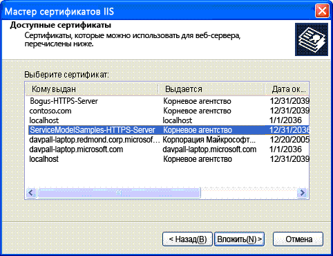

# Инструкции по установке сертификата сервера в службах IIS
Чтобы запускать образцы, которые безопасным образом взаимодействуют со службами IIS, необходимо создать и установить сертификат сервера.  
  
## Шаг 1.Создание сертификатов  
 Чтобы создать сертификат для своего компьютера, откройте командную строку Visual Studio с правами администратора и запустите файл Setup.bat, входящий в состав каждого из образцов, где используется безопасный обмен данными с IIS.Перед запуском пакетного файла убедитесь, что путь включает папку, содержащую программу Makecert.exe.Следующая команда служит для создания сертификата в файле Setup.bat.  
  
```  
makecert -sr LocalMachine -ss My -n CN=ServiceModelSamples-HTTPS-Server -sky exchange -sk ServiceModelSamples-HTTPS-Key  
```  
  
## Шаг 2.Установка сертификатов  
 Шаги, необходимые для установки созданных сертификатов, зависят от используемой версии IIS.  
  
#### Установка IIS в IIS 5.1 \(Windows XP\) и IIS 6.0 \(Windows Server 2003\)  
  
1.  Откройте оснастку консоли MMC диспетчера служб IIS.  
  
2.  Щелкните правой кнопкой мыши веб\-узла по умолчанию и выберите пункт **Свойства**.  
  
3.  Перейдите на вкладку **Безопасность каталога**.  
  
4.  Нажмите кнопку **Сертификат сервера**.Будет запущен мастер сертификатов веб\-сервера.  
  
5.  Выполните указания мастера.Выберите назначение сертификата.Из отображаемого списка сертификатов выберите сертификат ServiceModelSamples\-HTTPS\-Server.  
  
       
  
6.  Протестируйте доступ к службе в браузере, воспользовавшись HTTPS\-адресом https:\/\/localhost\/servicemodelsamples\/service.svc.  
  
#### Если до этого был настроен протокол SSL с помощью Httpcfg.exe  
  
1.  С помощью программы Makecert.exe \(или запустив файл Setup.bat\) создайте сертификат сервера.  
  
2.  Запустите диспетчер IIS и установите сертификат в соответствии с описанными выше действиями.  
  
3.  Добавьте следующую строку кода в клиентскую программу.  
  
> [!IMPORTANT]
>  Этот код необходим только для тестовых сертификатов, наподобие созданных с помощью Makecert.exe.Для кода производственного назначения это делать не рекомендуется.  
  
```  
PermissiveCertificatePolicy.Enact("CN=ServiceModelSamples-HTTPS-Server");  
```  
  
#### Установка IIS в IIS 7.0 \(Windows Vista и Windows Server 2008\)  
  
1.  В меню **Пуск** выберите пункт **Выполнить** и введите команду **inetmgr**, чтобы открыть оснастку консоли управления \(MMC\) IIS.  
  
2.  Щелкните правой кнопкой мыши **Веб\-узел по умолчанию** и выберите пункт **Изменить привязки…**  
  
3.  В диалоговом окне **Привязки узла** нажмите кнопку **Добавить**.  
  
4.  В раскрывающемся списке **Тип** выберите вариант **HTTPS**.  
  
5.  В раскрывающемся списке **SSL\-сертификат** выберите **ServiceModelSamples\-HTTPS\-Server** и нажмите кнопку **ОК**.  
  
6.  Протестируйте доступ к службе в браузере, воспользовавшись HTTPS\-адресом https:\/\/localhost\/servicemodelsamples\/service.svc.  
  
> [!NOTE]
>  Поскольку только что установленный тестовый сертификат не является доверенным сертификатом, при переходе по локальным веб\-адресам, защищенным с помощью этого сертификата, могут появиться дополнительные предупреждения системы безопасности Internet Explorer.  
  
## Удаление сертификатов  
  
-   Выполните с помощью диспетчера служб IIS действия, описанные выше, но вместо добавления сертификата или привязки удалите их.  
  
-   Удалите сертификат компьютера с помощью следующей команды.  
  
    ```  
    httpcfg delete ssl -i 0.0.0.0:443  
    ```