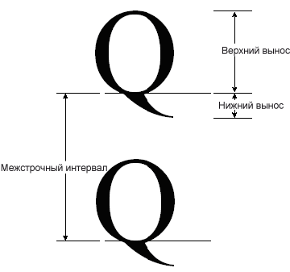

# Практическое руководство. Получение метрик шрифтов
<xref:System.Drawing.FontFamily> Класс предоставляет следующие методы для получения различных метрик для определенного семейства и стиля сочетания:  
  
-   <xref:System.Drawing.FontFamily.GetEmHeight%2A>(FontStyle)  
  
-   <xref:System.Drawing.FontFamily.GetCellAscent%2A>(FontStyle)  
  
-   <xref:System.Drawing.FontFamily.GetCellDescent%2A>(FontStyle)  
  
-   <xref:System.Drawing.FontFamily.GetLineSpacing%2A>(FontStyle)  
  
 Номера, возвращаемые этими методами, в единицах измерения конструктора, поэтому они не зависят от размера и единиц измерения конкретного <xref:System.Drawing.Font> объекта.  
  
 На следующем рисунке различные метрики.  
  
   
  
## Пример  
 В следующем примере отображаются метрики для семейства шрифтов Arial обычного стиля. Код также создает <xref:System.Drawing.Font> объекта (на основании семейства шрифтов Arial) с размером в 16 пикселей и отображаются метрики (в пикселях) для этой конкретной <xref:System.Drawing.Font> объекта.  
  
 Ниже показан результат выполнения примера кода.  
  
   
  
 Обратите внимание, первые две строки выходных данных на предыдущем рисунке. <xref:System.Drawing.Font> Размер 16, возвращает объект и <xref:System.Drawing.FontFamily> объект возвращает максимального пробела, равный 2048. Эти два числа (16 и 2048) являются основой для преобразования между единицах измерения конструктора и единиц (в данном случае это пиксели) <xref:System.Drawing.Font> объекта.  
  
 Например можно преобразовать единицах измерения конструктора Восхождение точек следующим образом:  
  
   
  
 Следующий код располагает текст по вертикали, устанавливая <xref:System.Drawing.PointF.Y%2A> данными-членом <xref:System.Drawing.PointF> объекта. Координата y увеличивается на `font.Height` для каждой новой строки текста. <xref:System.Drawing.Font.Height%2A> Свойство <xref:System.Drawing.Font> объект возвращает межстрочный интервал (в пикселях) для этой конкретной <xref:System.Drawing.Font> объекта. В этом примере возвращаемое значение <xref:System.Drawing.Font.Height%2A> равно 19. Обратите внимание, что это то же самое число (округляется в сторону увеличения до целого), получаемому при преобразовании метрики межстрочного интервала в пикселях.  
  
 Обратите внимание, что (также называемые размер размер или em) не является сумма Восхождение и спуск. Сумма размеров верхнего и спуск называется высота ячейки. Высота ячейки минус внутренней начальные равно высоту максимального пробела. Высота ячейки, а также внешних начальные равно межстрочный интервал.  
  
 [!code-csharp[System.Drawing.FontsAndText#71](../../../../samples/snippets/csharp/VS_Snippets_Winforms/System.Drawing.FontsAndText/CS/Class1.cs#71)]
 [!code-vb[System.Drawing.FontsAndText#71](../../../../samples/snippets/visualbasic/VS_Snippets_Winforms/System.Drawing.FontsAndText/VB/Class1.vb#71)]  
  
## Компиляция кода  
 Предыдущий пример кода предназначен для работы с Windows Forms и требует <xref:System.Windows.Forms.PaintEventArgs> `e`, который является параметром <xref:System.Windows.Forms.PaintEventHandler>.  
  
## См. также  
 [Объекты Graphics и Drawing в Windows Forms](../../../../docs/framework/winforms/advanced/graphics-and-drawing-in-windows-forms.md)  
 [Работами со шрифтами и текстом](../../../../docs/framework/winforms/advanced/using-fonts-and-text.md)
