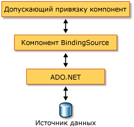

# Общие сведения о компоненте BindingSource
Компонент <xref:System.Windows.Forms.BindingSource> предназначен для упрощения процесса привязки элементов управления к источнику данных. Компонент <xref:System.Windows.Forms.BindingSource> выступает в качестве источника и канала передачи данных для привязки других элементов управления. Он реализует абстракцию подключения данных формы, перенаправляя команды к базовому списку данных. Кроме того, можно добавлять данные непосредственно в него, поэтому сам компонент выступает и в качестве источника данных.  
  
## Компонент BindingSource в качестве посредника  
 Компонент <xref:System.Windows.Forms.BindingSource> выступает в качестве источника данных для некоторых или всех элементов управления формы. В Visual Studio <xref:System.Windows.Forms.BindingSource> можно привязать к элементу управления с помощью параметра `DataBindings` свойство, доступное из **свойства** окна. См. также [Практическое руководство. Связывание элементов управления Windows Forms с компонентом BindingSource с помощью конструктора](../../../../docs/framework/winforms/controls/bind-wf-controls-with-the-bindingsource.md).  
  
 Компонент <xref:System.Windows.Forms.BindingSource> можно привязать как к источникам простых данных, например одиночному свойству объекта или базовой коллекции, такому как <xref:System.Collections.ArrayList>, так и к источникам сложных данных, таким как таблица базы данных. Компонент <xref:System.Windows.Forms.BindingSource> является посредником, обеспечивающим привязку и управление валютой. Во время разработки или во время выполнения компонент <xref:System.Windows.Forms.BindingSource> можно привязать к источнику сложных данных, указав в качестве значений его свойств <xref:System.Windows.Forms.BindingSource.DataSource%2A> и <xref:System.Windows.Forms.BindingSource.DataMember%2A> базу данных и таблицу. На следующем рисунке показано, как компонент <xref:System.Windows.Forms.BindingSource> встраивается в существующую архитектуру привязки данных.  
  
   
  
> [!NOTE]
>  Во время разработки некоторые действия, например перетаскивание таблицы базы данных из окна данных в пустую форму, приведут к созданию компонента <xref:System.Windows.Forms.BindingSource>, его привязке к базовому источнику данных и добавлению элементов управления данными в одной операции. См. также [Привязка элементов управления Windows Forms к данным в Visual Studio](/visualstudio/data-tools/bind-windows-forms-controls-to-data-in-visual-studio).  
  
## Компонент BindingSource в качестве источника данных  
 Если начать добавлять элементы в компонент <xref:System.Windows.Forms.BindingSource> компонента без указания списка для привязки, то компонент будет действовать как источник данных в виде списка и примет эти элементы.  
  
 Кроме того, можно написать код, чтобы добавить пользовательскую функциональность "AddNew" с помощью события <xref:System.Windows.Forms.BindingSource.AddingNew>, которое возникает при вызове метода <xref:System.Windows.Forms.BindingSource.AddNew%2A> перед добавлением элемента в список. Дополнительные сведения см. в разделе [Архитектура компонента BindingSource](../../../../docs/framework/winforms/controls/bindingsource-component-architecture.md).  
  
## Навигация  
 Для пользователей, которым необходимо перемещение данных в форме, компонент  <xref:System.Windows.Forms.BindingNavigator> предоставляет возможность перемещения данных и управления ими совместно с компонентом <xref:System.Windows.Forms.BindingSource>. Дополнительные сведения см. в разделе [Элемент управления BindingNavigator](../../../../docs/framework/winforms/controls/bindingnavigator-control-windows-forms.md).  
  
## Обработка данных  
 <xref:System.Windows.Forms.BindingSource> выступает в качестве <xref:System.Windows.Forms.CurrencyManager> для всех привязок и, таким образом, может предоставлять доступ к сведениям о валюте и положении в зависимости от источника данных. В следующей таблице показаны члены, предоставляемые компонентом <xref:System.Windows.Forms.BindingSource> для доступа и обработки базовых данных.  
  
|Член|Описание|  
|------------|-----------------|  
|Свойство <xref:System.Windows.Forms.BindingSource.Current%2A>|Возвращает текущий элемент источника данных.|  
|Свойство <xref:System.Windows.Forms.BindingSource.Position%2A>|Возвращает или задает текущую позицию в базовом списке.|  
|Свойство <xref:System.Windows.Forms.BindingSource.List%2A>|Возвращает список, который является результатом вычисления <xref:System.Windows.Forms.BindingSource.DataSource%2A> и <xref:System.Windows.Forms.BindingSource.DataMember%2A>. Если свойство <xref:System.Windows.Forms.BindingSource.DataMember%2A> не задано, то возвращается список, указанный в <xref:System.Windows.Forms.BindingSource.DataSource%2A>.|  
|Метод <xref:System.Windows.Forms.BindingSource.Insert%2A>|Вставляет элемент в список по указанному индексу.|  
|Метод <xref:System.Windows.Forms.BindingSource.RemoveCurrent%2A>|Удаляет текущий элемент из списка.|  
|Метод <xref:System.Windows.Forms.BindingSource.EndEdit%2A>|Применяет ожидающие изменения к базовому источнику данных.|  
|Метод <xref:System.Windows.Forms.BindingSource.CancelEdit%2A>|Отменяет текущую операцию редактирования.|  
|Метод <xref:System.Windows.Forms.BindingSource.AddNew%2A>|Добавляет новый элемент в базовый список. Если источник данных реализует <xref:System.ComponentModel.IBindingList> и возвращает элемент из события <xref:System.Windows.Forms.BindingSource.AddingNew>, то  добавляется этот элемент. В противном случае запрос передается в метод <xref:System.ComponentModel.IBindingList.AddNew%2A> списка. Если базовый список не является <xref:System.ComponentModel.IBindingList>, элемент автоматически создается с помощью его общего конструктора по умолчанию.|  
  
## Сортировка и фильтрация  
 Как правило, работа осуществляется с упорядоченным или отфильтрованным представлением источника данных. В следующей таблице показаны члены, предоставляемые компонентом <xref:System.Windows.Forms.BindingSource> источника данных.  
  
|Член|Описание|  
|------------|-----------------|  
|Свойство <xref:System.Windows.Forms.BindingSource.Sort%2A>|Если источником данных является <xref:System.ComponentModel.IBindingList>, то возвращает или задает имя столбца, используемого для сортировки, и порядок сортировки. Если источником данных является <xref:System.ComponentModel.IBindingListView> и поддерживается расширенная сортировка, то возвращает имена нескольких столбцов, используемых для сортировки, и порядок сортировки|  
|Свойство <xref:System.Windows.Forms.BindingSource.Filter%2A>|Если источником данных является <xref:System.ComponentModel.IBindingListView>, то возвращает или задает выражение, используемое для фильтрации просматриваемых строк.|  
  
## См. также  
 <xref:System.Windows.Forms.BindingSource>  
 <xref:System.Windows.Forms.BindingNavigator>  
 [Архитектура компонента BindingSource](../../../../docs/framework/winforms/controls/bindingsource-component-architecture.md)  
 [Компонент BindingSource](../../../../docs/framework/winforms/controls/bindingsource-component.md)  
 [Элемент управления BindingNavigator](../../../../docs/framework/winforms/controls/bindingnavigator-control-windows-forms.md)  
 [Привязка данных Windows Forms](../../../../docs/framework/winforms/windows-forms-data-binding.md)  
 [Элементы управления для использования в Windows Forms](../../../../docs/framework/winforms/controls/controls-to-use-on-windows-forms.md)
