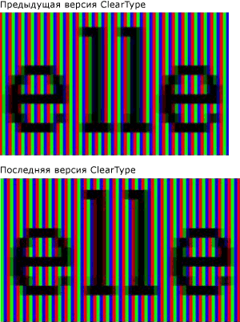
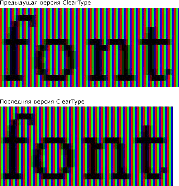

# Общие сведения о технологии ClearType
В этой статье дается обзор технологии [!INCLUDE[TLA#tla_ct](../../../../includes/tlasharptla-ct-md.md)], доступной в [!INCLUDE[TLA#tla_winclient](../../../../includes/tlasharptla-winclient-md.md)].  
  
  
   
## Общие сведения о технологии  
 [!INCLUDE[TLA2#tla_ct](../../../../includes/tla2sharptla-ct-md.md)] — это программная технология, разработанная [!INCLUDE[TLA#tla_ms](../../../../includes/tlasharptla-ms-md.md)] для улучшения удобочитаемости текста на современных ЖК-мониторах (жидкокристаллических дисплеях), например экранах ноутбуков, карманных ПК и плоскопанельных мониторах.  [!INCLUDE[TLA2#tla_ct](../../../../includes/tla2sharptla-ct-md.md)] работает путем обращения к отдельным элементам вертикальных цветных полос в каждом пикселе ЖК-экрана. До представления технологии [!INCLUDE[TLA2#tla_ct](../../../../includes/tla2sharptla-ct-md.md)] минимальным уровнем детализации изображения на компьютере был один пиксель, однако благодаря [!INCLUDE[TLA2#tla_ct](../../../../includes/tla2sharptla-ct-md.md)] на ЖК-экране могут отображаться детали текста вплоть до доли ширины пикселя. Дополнительное разрешение повышает четкость мелких деталей отображаемого текста, значительно облегчая его длительное чтение.  
  
 Технология [!INCLUDE[TLA2#tla_ct](../../../../includes/tla2sharptla-ct-md.md)], доступная в [!INCLUDE[TLA#tla_winclient](../../../../includes/tlasharptla-winclient-md.md)], — это новое поколение [!INCLUDE[TLA2#tla_ct](../../../../includes/tla2sharptla-ct-md.md)], которое включает несколько преимуществ по сравнению с версией [!INCLUDE[TLA#tla_gdi](../../../../includes/tlasharptla-gdi-md.md)].  
  
   
## Субпиксельная отрисовка  
 Значительным преимуществом по сравнению с предыдущей версией [!INCLUDE[TLA2#tla_ct](../../../../includes/tla2sharptla-ct-md.md)] является использование субпиксельной отрисовки. В отличие от реализации [!INCLUDE[TLA2#tla_ct](../../../../includes/tla2sharptla-ct-md.md)] в [!INCLUDE[TLA2#tla_gdi](../../../../includes/tla2sharptla-gdi-md.md)] технология [!INCLUDE[TLA2#tla_ct](../../../../includes/tla2sharptla-ct-md.md)] в [!INCLUDE[TLA#tla_winclient](../../../../includes/tlasharptla-winclient-md.md)] позволяет глифам начинаться внутри пикселя, а не только на его начальной границе. Благодаря дополнительному разрешению при отрисовке глифов интервалы и пропорции глифов становятся более точными и согласованными.  
  
 В следующих двух примерах показано, как глифы могут начинаться на любой субпиксельной границе при использовании субпиксельной отрисовки. Отрисовка примера справа выполнена с использованием более ранней версии отрисовщика [!INCLUDE[TLA2#tla_ct](../../../../includes/tla2sharptla-ct-md.md)], в котором не использовалась субпиксельная отрисовка. Отрисовка примера справа выполнена с использованием новой версии отрисовщика [!INCLUDE[TLA2#tla_ct](../../../../includes/tla2sharptla-ct-md.md)] и функции субпиксельной отрисовки. Обратите внимание на то, что каждая буква **e** и **l** на рисунке справа отображается немного по-разному, так разные глифы начинаются в разных субпикселях. При просмотре текста в обычном размере на экране это различие незаметно из-за высокой контрастности изображения глифа. Это возможно только благодаря сложной цветовой фильтрации, которая включена в функцию [!INCLUDE[TLA2#tla_ct](../../../../includes/tla2sharptla-ct-md.md)].  
  
   
Текст, отображаемый более ранней и более поздней версией ClearType  
  
 Сравните вывод предыдущего отрисовщика [!INCLUDE[TLA2#tla_ct](../../../../includes/tla2sharptla-ct-md.md)] с новой версией отрисовщика [!INCLUDE[TLA2#tla_ct](../../../../includes/tla2sharptla-ct-md.md)] в следующих двух примерах. Субпиксельная отрисовка, показанная справа, значительно улучшает плотность знаков на экране, особенно при небольших размерах, когда разница между субпикселем и целым пикселем представляет значительную часть ширины глифа. Обратите внимание, что расстояние между буквами более однородно на втором изображении. Совокупное влияние субпиксельной отрисовки на общий вид текста на экране значительно увеличено и демонстрирует существенное развитие технологии [!INCLUDE[TLA2#tla_ct](../../../../includes/tla2sharptla-ct-md.md)].  
  
   
Текст, отображаемый более ранней и более поздней версией ClearType  
  
   
## Сглаживание по оси Y  
 Другим преимуществом [!INCLUDE[TLA2#tla_ct](../../../../includes/tla2sharptla-ct-md.md)] в [!INCLUDE[TLA#tla_winclient](../../../../includes/tlasharptla-winclient-md.md)] является сглаживание по оси Y. [!INCLUDE[TLA2#tla_ct](../../../../includes/tla2sharptla-ct-md.md)] в [!INCLUDE[TLA2#tla_gdi](../../../../includes/tla2sharptla-gdi-md.md)] без сглаживания по оси Y обеспечивает лучшее разрешение по оси X, но не Y. В верхних и нижних границах мелких изгибов неровные края влияют на их удобочитаемость.  
  
 В следующем примере к тексту не применено сглаживание по оси Y. В этом случае неровные края верхней и нижней частей буквы сильно заметны.  
  
   
Текст с неровными краями у мелких изгибов  
  
 [!INCLUDE[TLA2#tla_ct](../../../../includes/tla2sharptla-ct-md.md)] в [!INCLUDE[TLA#tla_winclient](../../../../includes/tlasharptla-winclient-md.md)] обеспечивает сглаживание по оси Y, позволяющее сгладить неровные края. Это особенно важно для повышения удобочитаемости восточно-азиатских языков, в которых иероглифы имеют почти равное количество горизонтальных и вертикальных мелких изгибов.  
  
 В следующем примере к тексту применено сглаживание по оси Y. В этом случае заметны гладкие изгибы верхней и нижней частей буквы.  
  
   
Текст со сглаживанием ClearType по оси Y  
  
   
## Аппаратное ускорение  
 [!INCLUDE[TLA2#tla_ct](../../../../includes/tla2sharptla-ct-md.md)] в [!INCLUDE[TLA#tla_winclient](../../../../includes/tlasharptla-winclient-md.md)] может использовать преимущества аппаратного ускорения для повышения производительности и снижения нагрузки на ЦП и системную память. Используя построители текстуры и память видеокарты, [!INCLUDE[TLA2#tla_ct](../../../../includes/tla2sharptla-ct-md.md)] обеспечивает быструю визуализацию текста, особенно при использовании анимации.  
  
 [!INCLUDE[TLA2#tla_ct](../../../../includes/tla2sharptla-ct-md.md)] в [!INCLUDE[TLA#tla_winclient](../../../../includes/tlasharptla-winclient-md.md)] не изменяет параметры [!INCLUDE[TLA2#tla_ct](../../../../includes/tla2sharptla-ct-md.md)] на уровне системы. Отключение [!INCLUDE[TLA2#tla_ct](../../../../includes/tla2sharptla-ct-md.md)] в [!INCLUDE[TLA#tla_mswin](../../../../includes/tlasharptla-mswin-md.md)] задает [!INCLUDE[TLA#tla_winclient](../../../../includes/tlasharptla-winclient-md.md)] для сглаживания режим "оттенки серого". Кроме того, [!INCLUDE[TLA2#tla_ct](../../../../includes/tla2sharptla-ct-md.md)] в [!INCLUDE[TLA#tla_winclient](../../../../includes/tlasharptla-winclient-md.md)] не изменяет параметры [средства настройки ClearType, PowerToy](https://www.microsoft.com/typography/ClearTypePowerToy.mspx).  
  
 Одно из архитектурных решений [!INCLUDE[TLA#tla_winclient](../../../../includes/tlasharptla-winclient-md.md)] предполагает наличие независимого от разрешения макета, который обеспечивает более эффективную поддержку мониторов с высоким разрешением, получающих все большее распространение. Вследствие этого [!INCLUDE[TLA#tla_winclient](../../../../includes/tlasharptla-winclient-md.md)] не поддерживает отрисовку сглаженного текста или точечных рисунков в некоторых восточно-азиатских шрифтах, поскольку они являются зависимыми от разрешения.  
  
   
## Дополнительные сведения  
 [Сведения о технологии ClearType](https://www.microsoft.com/typography/ClearTypeInfo.mspx)  
  
 [Средство настройки ClearType, PowerToy](https://www.microsoft.com/typography/ClearTypePowerToy.mspx)  
  
## См. также  
 [Параметры реестра ClearType](../../../../docs/framework/wpf/advanced/cleartype-registry-settings.md)
