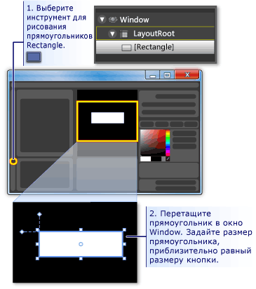
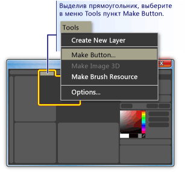
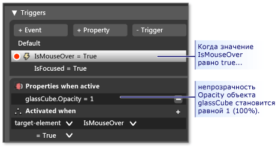
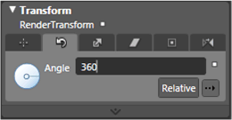
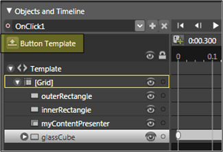

# Пошаговое руководство. Создание кнопки с помощью Microsoft Expression Blend
Пошаговом руководстве описывается процесс создания [!INCLUDE[TLA2#tla_wpf](../../../../includes/tla2sharptla-wpf-md.md)] настраиваемая кнопка, с помощью пакета Microsoft Expression Blend.  
  
> [!IMPORTANT]
>  Microsoft Expression Blend работает путем создания [!INCLUDE[TLA#tla_xaml](../../../../includes/tlasharptla-xaml-md.md)] , затем компилируется для получения исполняемой программы. Если вы работать и с [!INCLUDE[TLA#tla_xaml](../../../../includes/tlasharptla-xaml-md.md)] напрямую, имеется другой Пошаговое руководство, которое создает то же приложение, как это, используя [!INCLUDE[TLA#tla_xaml](../../../../includes/tlasharptla-xaml-md.md)] с Visual Studio, а не Blend. В разделе [Создание кнопки с помощью XAML](../../../../docs/framework/wpf/controls/walkthrough-create-a-button-by-using-xaml.md) для получения дополнительной информации.  
  
 На следующем рисунке настраиваемая кнопка будет создан.  
  
   
  
## Преобразование фигуры в кнопку  
 В первой части этого пошагового руководства создайте пользовательский вид пользовательской кнопки. Для этого сначала преобразовать прямоугольник в кнопку. После этого добавить дополнительные фигуры в шаблон кнопки, создание более сложных внешнего вида кнопки. Почему бы не начать с обычной кнопки и преобразовать ее? Так как кнопка имеет встроенные функции не требуется; для пользовательских кнопок проще начать с прямоугольника.  
  
#### Чтобы создать новый проект в Expression Blend  
  
1.  Запустите Expression Blend. (Щелкните **запустить**, пункты **все программы**, пункты **Microsoft Expression**, а затем нажмите кнопку **Microsoft Expression Blend**.)  
  
2.  При необходимости разверните приложение.  
  
3.  В меню **Файл** выберите пункт **Создать проект**.  
  
4.  Выберите **стандартное приложение (.exe)**.  
  
5.  Назовите проект `CustomButton` и нажмите клавишу **ОК**.  
  
 На этом этапе имеется пустой [!INCLUDE[TLA2#tla_wpf](../../../../includes/tla2sharptla-wpf-md.md)] проекта. Нажать клавишу F5 для запуска приложения. Как и следует ожидать, приложение состоит из пустое окно. Затем создайте Скругленный прямоугольник и преобразовать его в кнопку.  
  
#### Чтобы преобразовать прямоугольник в кнопку  
  
1.  **Присвойте свойству фона окна черный:** выберите окно, нажмите кнопку **вкладка свойств**и задайте <xref:System.Windows.Controls.Control.Background%2A> свойства `Black`.  
  
       
  
2.  **Нарисовать прямоугольник приблизительного размера кнопки в окне:** выберите инструмент «прямоугольник» на панели слева средство и перетащите прямоугольник в окне.  
  
       
  
3.  **Round out углов прямоугольника:** перетащите контрольные точки прямоугольника или непосредственная установка <xref:System.Windows.Shapes.Rectangle.RadiusX%2A> и <xref:System.Windows.Shapes.Rectangle.RadiusY%2A> свойства. Задайте значения <xref:System.Windows.Shapes.Rectangle.RadiusX%2A> и <xref:System.Windows.Shapes.Rectangle.RadiusY%2A> до 20 символов.  
  
       
  
4.  **Измените прямоугольник в кнопке:** выберите прямоугольник. На **средства** меню, нажмите кнопку **создать кнопку**.  
  
       
  
5.  **Укажите область стиля или шаблона:** , как появляется следующее окно.  
  
       
  
     Для **имя ресурса (ключ)** выберите **применить ко всем**.  Это сделает полученного стиля и шаблона кнопки, которые применяются ко всем объектам, которые являются кнопками. Для **определения в**выберите **приложения**. Это сделает полученного стиля и шаблона кнопки области на все приложение. При установке значения в этих двух полях, стиль кнопки и шаблон применяются ко всем кнопкам в приложении, и любой кнопки, созданные в приложении будет по умолчанию использовать этот шаблон.  
  
## Изменение шаблона кнопки  
 Теперь у вас есть прямоугольник, который был изменен на кнопке. В этом разделе можно изменить шаблон кнопки и дальнейшей ее внешний вид.  
  
#### Чтобы изменить шаблон кнопки, чтобы изменить внешний вид кнопки  
  
1.  **Перейдите в режим редактирования шаблона:** для дальнейшей настройки внешнего вида кнопку, нам нужно изменить шаблон кнопки. Этот шаблон был создан в результате преобразования прямоугольника в кнопку. Чтобы изменить шаблон кнопки, правой кнопкой мыши и выберите **изменить части элемента управления (шаблон)** и затем **изменить шаблон**.  
  
       
  
     В редакторе шаблонов Обратите внимание на то, что кнопки теперь разделены на <xref:System.Windows.Shapes.Rectangle> и <xref:System.Windows.Controls.ContentPresenter>. <xref:System.Windows.Controls.ContentPresenter> Используется для представления содержимого кнопки (например, строка «Кнопка»). Оба прямоугольника и <xref:System.Windows.Controls.ContentPresenter> располагаются внутри <xref:System.Windows.Controls.Grid>.  
  
       
  
2.  **Измените имена компонентов шаблона:** щелкните правой кнопкой мыши прямоугольник в перечне шаблон изменения <xref:System.Windows.Shapes.Rectangle> имя из «[прямоугольник]» для «скопировав outerRectangle» и измените «[ContentPresenter]» на «myContentPresenter».  
  
       
  
3.  **ALTER прямоугольник, чтобы он был пустым внутри (например, кольцо):** выберите **скопировав outerRectangle** и задайте <xref:System.Windows.Shapes.Shape.Fill%2A> значение «Прозрачный» и <xref:System.Windows.Shapes.Shape.StrokeThickness%2A> до 5.  
  
       
  
     Затем установите <xref:System.Windows.Shapes.Shape.Stroke%2A> все, что шаблон будет цвет. Чтобы сделать это, щелкните небольшой белый квадрат рядом **штриха**выберите **CustomExpression**и введите «{TemplateBinding фона}» в диалоговом окне.  
  
       
  
4.  **Создать внутренний прямоугольник:** теперь создать другого прямоугольника (присвойте ей имя «innerRectangle») и разместите его симметрично внутри **скопировав outerRectangle** . Для такой работы возможно, требуется увеличить, чтобы увеличить кнопку в области редактирования.  
  
    > [!NOTE]
    >  Прямоугольник может выглядеть отличается от того, на рисунке (например, он может иметь скругленные углы).  
  
       
  
5.  **Переместить в начало ContentPresenter:** на этом этапе, возможно, что текст «Button» не будут видны больше. Если Да, это вызвано **innerRectangle** является надстройкой над **myContentPresenter**. Чтобы устранить эту проблему, перетащите **myContentPresenter** ниже **innerRectangle**. Изменить положение прямоугольников и **myContentPresenter** для выглядеть примерно следующим образом.  
  
    > [!NOTE]
    >  Кроме того, можно также разместить **myContentPresenter** в верхней части, щелкнув его и нажав клавишу **отправить Далее**.  
  
       
  
6.  **Изменение внешнего вида innerRectangle:** задать <xref:System.Windows.Shapes.Rectangle.RadiusX%2A>, <xref:System.Windows.Shapes.Rectangle.RadiusY%2A>, и <xref:System.Windows.Shapes.Shape.StrokeThickness%2A> значения до 20 символов. Задать in Addition, <xref:System.Windows.Shapes.Shape.Fill%2A> фона для шаблона с помощью пользовательского выражения «{TemplateBinding фона}») и задайте <xref:System.Windows.Shapes.Shape.Stroke%2A> на «прозрачный». Обратите внимание, что параметры для <xref:System.Windows.Shapes.Shape.Fill%2A> и <xref:System.Windows.Shapes.Shape.Stroke%2A> из **innerRectangle** противоположны для **скопировав outerRectangle**.  
  
       
  
7.  **Добавьте прозрачный слой поверх:** Заключительная часть настройки внешнего вида кнопки — Добавление прозрачный слой в верхней части. Этот прозрачный слой состоит из третьего прямоугольника. Поскольку стекла будет охватывать всю кнопку, прозрачный прямоугольник аналогично измерения **скопировав outerRectangle**. Таким образом, создайте прямоугольник, просто копия **скопировав outerRectangle**. Выделите **скопировав outerRectangle** и используйте сочетание клавиш CTRL + C и CTRL + V для создания копии. Назовите этот новый прямоугольник «glassCube».  
  
8.  **При необходимости, изменить положение glassCube:** Если **glassCube** — еще не находится, чтобы он охватывает всю кнопку, перетащите его в нужное место.  
  
9. **Предоставьте glassCube немного отличен от скопировав outerRectangle:** изменение свойств **glassCube**. Начните с изменения <xref:System.Windows.Shapes.Rectangle.RadiusX%2A> и <xref:System.Windows.Shapes.Rectangle.RadiusY%2A> свойства до 10 и <xref:System.Windows.Shapes.Shape.StrokeThickness%2A> 2.  
  
       
  
10. **Сделать выглядеть стекла glassCube:** задать <xref:System.Windows.Shapes.Shape.Fill%2A> для стеклянного вида с помощью линейного градиента со значением непрозрачности 75%, который переключается между белым и прозрачным более 6 приблизительно равномерно расположенных интервалов времени. Это то, что значение позиции градиента:  
  
    -   Градиента 1: Белый значение альфа 75%  
  
    -   Остановка градиента 2: прозрачный  
  
    -   Градиента 3: Белый значение альфа 75%  
  
    -   Остановка градиента 4: прозрачный  
  
    -   Градиента 5: Белый значение альфа 75%  
  
    -   Остановка градиента 6: прозрачный  
  
     При этом создается вид «волнистой» стекла.  
  
       
  
11. **Скрыть прозрачный слой:** теперь, когда вы видите, как выглядит стеклянного слоя, перейдите в **внешний вид области** из **«свойства»** и задайте прозрачность 0%, чтобы скрыть их. В разделах мы будем использовать триггеров свойства и события для отображения и преобразования прозрачного уровня.  
  
       
  
## Настройте поведение кнопки  
 На этом этапе вы настроили представление кнопки путем редактирования ее шаблона, но кнопка не реагирует на действия пользователя как обычные кнопки (например, изменение внешнего вида при наведении, получает фокус и щелкнув.) Следующие две процедуры показывают, как для сборки поведений подобные пользовательской кнопки. Мы будет начать с простого свойства триггеров, а затем добавьте триггеров событий и анимации.  
  
#### Чтобы задать триггеры свойств  
  
1.  **Создайте новый триггер свойства:** с **glassCube** , нажмите кнопку **+ свойство** в **триггеры** панели (см. рисунок ниже следующий шаг). Это создает триггер свойства с триггером свойства по умолчанию.  
  
2.  **Создайте свойство, используемое триггером IsMouseOver:** изменить свойство <xref:System.Windows.UIElement.IsMouseOver%2A>. Это делает при активации триггера свойства <xref:System.Windows.UIElement.IsMouseOver%2A> свойство `true` (при наведении указателя мыши на кнопку мыши).  
  
       
  
3.  **Непрозрачность 100% для glassCube триггеров IsMouseOver:** Обратите внимание, что **записи триггера** (см. предыдущий рисунок). Это означает, что любые изменения, внесенные в значения свойств **glassCube** во время записи станет действие, происходящее при <xref:System.Windows.UIElement.IsMouseOver%2A> — `true`. Во время записи, измените <xref:System.Windows.UIElement.Opacity%2A> из **glassCube** до 100%.  
  
       
  
     Вы создали первый триггер свойства. Обратите внимание, что **триггеры панели** зафиксировал редактора <xref:System.Windows.UIElement.Opacity%2A> изменен на 100%.  
  
       
  
     Нажмите клавишу F5 для запуска приложения и наведите указатель мыши над и отключение кнопки. Вы увидите прозрачный слой отображается, когда вы указатель кнопки и исчезает, когда указатель мыши покидает.  
  
4.  **Изменение значения штриха триггеров IsMouseOver:** позволяет связать другие действия с <xref:System.Windows.UIElement.IsMouseOver%2A> триггера. Во время записи, переключение сделанный выбор из **glassCube** для **скопировав outerRectangle**. Затем установите <xref:System.Windows.Shapes.Shape.Stroke%2A> из **скопировав outerRectangle** для пользовательское выражение «{DynamicResource {x: Static SystemColors.HighlightBrushKey}}». Это задает <xref:System.Windows.Shapes.Shape.Stroke%2A> чтобы стандартное выделите цвет кнопок. Нажмите клавишу F5, чтобы увидеть результат, когда указатель мыши на кнопку.  
  
       
  
5.  **Нечеткого текста триггеров IsMouseOver:** позволяет связывать один дополнительные действия для <xref:System.Windows.UIElement.IsMouseOver%2A> триггера свойства. Сделаете содержимое кнопки выглядят немного нечетким над ним появляется прозрачный. Чтобы сделать это, можно применить размытия <xref:System.Windows.Media.Effects.BitmapEffect> для <xref:System.Windows.Controls.ContentPresenter> (**myContentPresenter**).  
  
       
  
    > [!NOTE]
    >  Для возврата **«свойства»** обратно которое он имел раньше поиск <xref:System.Windows.Media.Effects.BitmapEffect>, удалите текст из **поле поиска**.  
  
     На этом этапе мы использовали триггер свойства с несколькими связанными действиями для создания поведения в тех, когда указатель мыши входит и покидает область кнопки. Другим обычным поведением для кнопки является выделять при получении фокуса (как после щелчка). Такое поведение можно добавить путем добавления другого триггера свойства для <xref:System.Windows.UIElement.IsFocused%2A> свойства.  
  
6.  **Создание триггера свойства для IsFocused:** с помощью той же процедуры, что и для <xref:System.Windows.UIElement.IsMouseOver%2A> (см. на первом шаге в этом разделе), создайте другой триггер свойства для <xref:System.Windows.UIElement.IsFocused%2A> свойства. Хотя **записи триггера**, добавьте следующие действия в триггер:  
  
    -   **glassCube** возвращает <xref:System.Windows.UIElement.Opacity%2A> 100%.  
  
    -   **скопировав outerRectangle** возвращает <xref:System.Windows.Shapes.Shape.Stroke%2A> пользовательское выражение значения «{DynamicResource {x: Static SystemColors.HighlightBrushKey}}».  
  
 В качестве последнего шага в данном пошаговом руководстве мы добавим анимации к кнопке. Эти анимации будут быть вызваны событиями — в частности, <xref:System.Windows.UIElement.MouseEnter> и <xref:System.Windows.Controls.Primitives.ButtonBase.Click> события.  
  
#### Использование триггеров событий и анимации для добавления интерактивности  
  
1.  **Создание триггера события MouseEnter:** добавить новый триггер событий и выбрать <xref:System.Windows.UIElement.MouseEnter> как событие для использования в триггере.  
  
       
  
2.  **Создайте временную шкалу анимации:** теперь необходимо связать график анимации для <xref:System.Windows.UIElement.MouseEnter> события.  
  
       
  
     После нажатия клавиши **ОК** для создания новой временной шкалы, **временная шкала** отображается и «Запись временной шкалы» отображается в панели конструктора. Это означает, что мы можем начать запись изменений свойств на временной шкале (изменения свойств анимации).  
  
    > [!NOTE]
    >  Может потребоваться изменить размер окна и/или панели для просмотра отображения.  
  
       
  
3.  **Создать ключевой кадр:** для создания анимации, выберите объект, для которого должна начаться анимация, создайте два или несколько ключевых кадров на временной шкале и этих ключевых кадров, задайте значения свойств, анимация для интерполяции. Следующий рисунок поможет создания ключевого кадра.  
  
       
  
4.  **Сжатие glassCube на этом кадре:** второй ключевой кадр выбран, сжатие **glassCube** до 90% полного размера с помощью **преобразования размер**.  
  
       
  
     Нажмите клавишу F5 для запуска приложения. Наведите указатель мыши на кнопку. Обратите внимание, что прозрачный слой сжимается в верхней части кнопки.  
  
5.  **Создайте другой триггер события и свяжите с ним другой анимации:** добавим один дополнительные анимации. Используйте аналогичную процедуру, чтобы вы использовали для создания предыдущей анимации триггера события:  
  
    1.  Создайте новый триггер события с помощью <xref:System.Windows.Controls.Primitives.ButtonBase.Click> событий.  
  
    2.  Свяжите новую временную шкалу с <xref:System.Windows.Controls.Primitives.ButtonBase.Click> событий.  
  
       
  
    1.  Для этой временной шкалы создайте два ключевых кадров, один на 0,0 секунде и второй на 0.3 секунде.  
  
    2.  Ключевой кадр на 0,3 секунде, установите **угол поворота преобразования** до 360 градусов.  
  
       
  
    1.  Нажмите клавишу F5 для запуска приложения. Нажмите кнопку. Обратите внимание, что прозрачный слой вращается.  
  
## Заключение  
 Завершена настройка кнопки. Вы сделали это с помощью шаблона кнопки, которая применялась ко всем кнопкам в приложении. Если оставить режим редактирования шаблонов (см. следующий рисунок) и создать дополнительные кнопки, вы увидите, что они выглядят и ведут себя подобно настраиваемой кнопки, а не как кнопка по умолчанию.  
  
   
  
   
  
 Нажмите клавишу F5 для запуска приложения. Нажмите кнопки и обратите внимание, как все они ведут себя одинаково.  
  
 Помните, что пока настройке шаблона, можно установить <xref:System.Windows.Shapes.Shape.Fill%2A> свойство **innerRectangle** и <xref:System.Windows.Shapes.Shape.Stroke%2A> свойство **скопировав outerRectangle** шаблона фона ({} TemplateBinding фона}). По этой причине при установке цвет фона отдельных кнопок, фон будет использоваться для соответствующих свойств. Попробуйте изменить фон сейчас. На следующем рисунке используются различные градиенты. Поэтому несмотря на то, что шаблон полезен для общей настройки элементов управления, таких как кнопки, элементы управления с помощью шаблонов может изменяться по-прежнему чтобы они отличались друг от друга.  
  
   
  
 В заключение в процессе настройки шаблона кнопки вы изучили в Microsoft Expression Blend выполните следующие действия:  
  
-   Настройка внешнего вида элемента управления.  
  
-   Установка свойства триггеров. Триггеры свойств очень полезны, поскольку они могут использоваться для большинства объектов, а не только для элементов управления.  
  
-   Установка триггеров событий. Триггеры событий очень полезны, поскольку они могут использоваться для большинства объектов, а не только для элементов управления.  
  
-   Создание анимаций.  
  
-   Создание градиентов, добавление BitmapEffects, с помощью преобразований и задание основных свойств объектов.  
  
## См. также  
 [Создание кнопки с помощью XAML](../../../../docs/framework/wpf/controls/walkthrough-create-a-button-by-using-xaml.md)  
 [Стилизация и использование шаблонов](../../../../docs/framework/wpf/controls/styling-and-templating.md)  
 [Общие сведения об эффектах анимации](../../../../docs/framework/wpf/graphics-multimedia/animation-overview.md)  
 [Общие сведения о закраске сплошным цветом и градиентом](../../../../docs/framework/wpf/graphics-multimedia/painting-with-solid-colors-and-gradients-overview.md)  
 [Общие сведения об эффектах для точечных рисунков](../../../../docs/framework/wpf/graphics-multimedia/bitmap-effects-overview.md)
