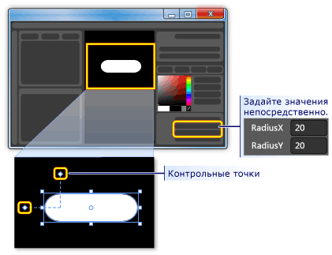
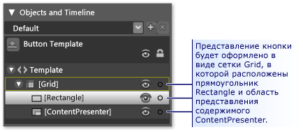
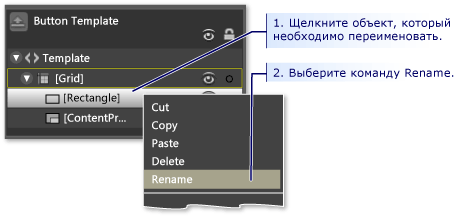
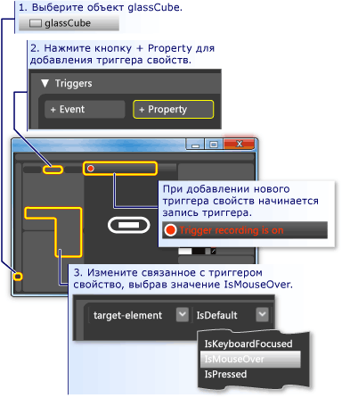
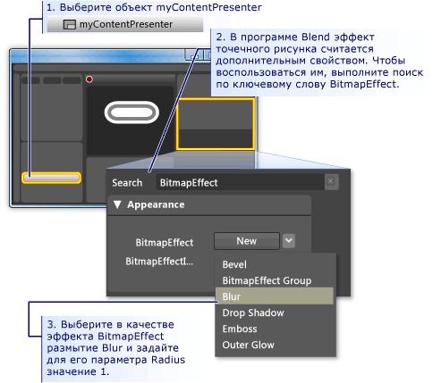
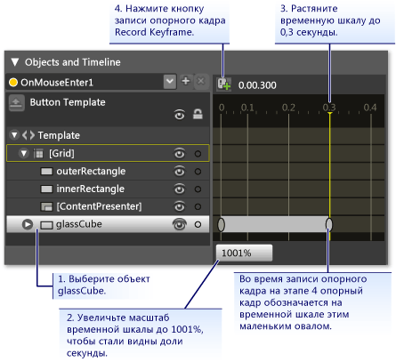
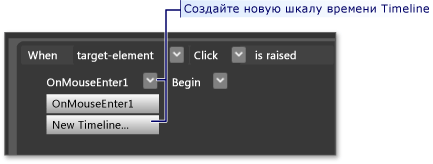
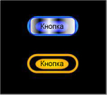

# Пошаговое руководство. Создание кнопки с помощью Microsoft Expression Blend
В данном руководстве вы проходите через процесс создания пользовательской кнопки [!INCLUDE[TLA2#tla_wpf](../../../../includes/tla2sharptla-wpf-md.md)] с помощью Microsoft Expression Blend.  
  
> [!IMPORTANT]
>  Microsoft Expression Blend функционирует путем создания [!INCLUDE[TLA#tla_xaml](../../../../includes/tlasharptla-xaml-md.md)], который затем компилируется для получения исполняемой программы.  Если вы предпочитаете непосредственно работать с [!INCLUDE[TLA#tla_xaml](../../../../includes/tlasharptla-xaml-md.md)], существует другое пошаговое руководство, которое создает то же приложение, как и это, используя [!INCLUDE[TLA#tla_xaml](../../../../includes/tlasharptla-xaml-md.md)] с [!INCLUDE[vs_current_short](../../../../includes/vs-current-short-md.md)] вместо Blend.  Дополнительные сведения см. в разделе [Создание кнопки с помощью XAML](../../../../docs/framework/wpf/controls/walkthrough-create-a-button-by-using-xaml.md).  
  
 На рисунке показана пользовательская кнопка, которую вы создадите.  
  
   
  
## Преобразование фигуры в кнопку  
 В первой части в данного руководства создается пользовательский вид пользовательской кнопки.  Чтобы сделать это, сначала следует преобразовать прямоугольник в кнопку.  Затем к шаблону кнопки добавляются вспомогательные фигуры для создания более сложного внешнего вида кнопки.  Почему не начать с обычной кнопки и преобразовать ее?  Потому что кнопка имеет встроенную функциональность, которая не требуется; для пользовательских кнопок проще начать с прямоугольника.  
  
#### Чтобы создать новый проект в Expression Blend  
  
1.  Запустите Expression Blend.  \(Нажмите кнопку **Пуск**, выберите пункт **Все программы**, пункт **Выражения Microsoft** и затем кликните **Microsoft Expression Blend**.\)  
  
2.  Разверните приложение, если необходимо.  
  
3.  В меню **Файл** выберите команду **Создать проект**.  
  
4.  Выберите **Стандартное приложение \(EXE\)**.  
  
5.  Дайте имя проекту `CustomButton` и нажмите кнопку **ОК**.  
  
 На этом этапе имеется пустой проект [!INCLUDE[TLA2#tla_wpf](../../../../includes/tla2sharptla-wpf-md.md)].  Нажмите клавишу F5 для запуска приложения.  Как может ожидать, приложение состоит только из пустого окна.  Затем создайте скругленный прямоугольник и преобразуйте его в кнопку.  
  
#### Чтобы преобразовать прямоугольник в кнопку  
  
1.  **Присвойте свойству фона окна значение "черный":** выберите окно и щелкните по **Properties Tab**, и установите <xref:System.Windows.Controls.Control.Background%2A> свойства `Black`.  
  
       
  
2.  **Нарисуйте прямоугольник, соответствующий размеру кнопки в окне:** Выделите прямоугольник на левой панели и перетащите его в окно.  
  
       
  
3.  **Скруглите углы прямоугольника:** Либо перетащите контрольные точки прямоугольника, либо непосредственно установите свойства <xref:System.Windows.Shapes.Rectangle.RadiusX%2A> и <xref:System.Windows.Shapes.Rectangle.RadiusY%2A>.  Задайте значения <xref:System.Windows.Shapes.Rectangle.RadiusX%2A> и <xref:System.Windows.Shapes.Rectangle.RadiusY%2A>, равные 20.  
  
       
  
4.  **Измените прямоугольник в кнопке:** Выберите прямоугольник.  В меню **Tools** выберите пункт **Создать кнопку**.  
  
       
  
5.  **Укажите область стиля\/шаблона:** Появится диалоговое окно наподобие следующего.  
  
       
  
     Выберите **Применить для всех** для **Имя ресурса \(Клавиша\)**.  Это приведет к применению полученного стиля и шаблона кнопки ко всем объектам, которые являются кнопками.  Выберите **Приложение** для **Определить в**.  Это распространит область действия полученного стиля и шаблона кнопки на все приложение.  При задании значений в этих двух полях, стиль кнопки и шаблон применятся ко всем кнопкам в приложении и любая созданная кнопка в приложении будет по умолчанию использовать этот шаблон.  
  
## Изменение шаблона кнопки  
 Итак, имеется прямоугольник, который был преобразован в кнопку.  В этом разделе будет изменен шаблон кнопки и преобразован ее внешний вид.  
  
#### Чтобы изменить шаблон кнопки следует изменить внешний вид кнопки  
  
1.  **Перейдите в представление редактирования шаблона:** Для дальнейшей настройки внешнего вида нашей кнопки необходимо изменить шаблон кнопки.  Этот шаблон был создан в результате преобразования прямоугольника в кнопку.  Чтобы изменить шаблон кнопки, щелкните правой кнопкой мыши кнопку и выберите **Изменить части элемента управления \(шаблон\)**, а затем **Изменить шаблон**.  
  
       
  
     В редакторе шаблонов обратите внимание, что кнопка теперь разделяется на <xref:System.Windows.Shapes.Rectangle> и <xref:System.Windows.Controls.ContentPresenter>.  <xref:System.Windows.Controls.ContentPresenter> используется для представления содержимого кнопки \(например, строка "Кнопка"\).  И прямоугольник, и <xref:System.Windows.Controls.ContentPresenter> располагаются внутри элемента <xref:System.Windows.Controls.Grid>.  
  
       
  
2.  **Измените имена компонентов шаблона:** щелкните правой кнопкой мыши прямоугольник в шаблоне, измените имя <xref:System.Windows.Shapes.Rectangle> с "\[Rectangle\]" на "outerRectangle" и измените "\[ContentPresenter\]" на "myContentPresenter".  
  
       
  
3.  **Преобразуйте прямоугольник так, чтобы он был пустым внутри \(как пончик\):** Выберите **outerRectangle** и установите <xref:System.Windows.Shapes.Shape.Fill%2A> на "Прозрачный" и <xref:System.Windows.Shapes.Shape.StrokeThickness%2A> на 5.  
  
       
  
     Затем задайте <xref:System.Windows.Shapes.Shape.Stroke%2A> значение цвета шаблона.  Чтобы сделать это, щелкните по маленькому полю белого цвета рядом со **Штрихом**, выберите **CustomExpression** и введите "{TemplateBinding фона}" в диалоговом окне.  
  
       
  
4.  **Создать внутренний прямоугольник:** Теперь создайте другой прямоугольник \(назовите его "innerRectangle"\) и установите его симметрично внутри **outerRectangle**.  Для этого вам, возможно, необходимо масштабирование, чтобы увеличить кнопку в области редактирования.  
  
    > [!NOTE]
    >  Прямоугольник может выглядеть иначе, чем на рисунке \(например, он может иметь скругленные углы\).  
  
       
  
5.  **Переместите ContentPresenter вверх:** На этом этапе, возможно, текст "Кнопка" больше не будет виден.  Если это так, это происходит потому, что **innerRectangle** расположен поверх **myContentPresenter**.  Чтобы исправить это, перетащите **myContentPresenter** под **innerRectangle**.  Переместите прямоугольники и **myContentPresenter** чтобы соответствовать рисунку, приведенному ниже.  
  
    > [!NOTE]
    >  Кроме того, можно также разместить **myContentPresenter** наверху, щелкнув правой кнопкой мыши по нему и выбрав **Отправить далее**.  
  
       
  
6.  **Изменение внешнего вида элемента innerRectangle.** Задайте значения <xref:System.Windows.Shapes.Rectangle.RadiusX%2A>, <xref:System.Windows.Shapes.Rectangle.RadiusY%2A> и <xref:System.Windows.Shapes.Shape.StrokeThickness%2A> равными 20.  Кроме того, задайте для свойства <xref:System.Windows.Shapes.Shape.Fill%2A> значение фона шаблона с помощью пользовательского выражения "{TemplateBinding Background}" и установите для свойства <xref:System.Windows.Shapes.Shape.Stroke%2A> значение "transparent".  Обратите внимание, что параметры <xref:System.Windows.Shapes.Shape.Fill%2A> <xref:System.Windows.Shapes.Shape.Stroke%2A> прямоугольника **innerRectangle** противоположны параметрам **outerRectangle**.  
  
       
  
7.  **Добавьте прозрачный слой наверх:** Последним фрагментом настройки внешнего вида кнопки является добавление прозрачного уровня сверху.  Этот прозрачный слой состоит из третьего прямоугольника.  Поскольку прозрачный слой покроет всю кнопку, прозрачный прямоугольник будет аналогичен **outerRectangle** по размерам.  Таким образом, создайте прямоугольник, просто скопировав **outerRectangle**.  Выделите **outerRectangl**  и используйте сочетание клавиш CTRL\+C и CTRL\+V для копирования.  Назовите этот новый прямоугольник "glassCube".  
  
8.  **Переместите glassCube при необходимости:** Если **glassCube** не располагается таким образом, чтобы покрыть весь кнопки, перетащите его в это положение.  
  
9. **Придайте glassCube немного отличающуюся от outerRectangle форму:** измените свойства **glassCube** Начните с изменения свойств <xref:System.Windows.Shapes.Rectangle.RadiusX%2A> и <xref:System.Windows.Shapes.Rectangle.RadiusY%2A> на значение 10 и <xref:System.Windows.Shapes.Shape.StrokeThickness%2A> — на значение 2.  
  
       
  
10. **Сделайте glassCube похожим на стекло:** <xref:System.Windows.Shapes.Shape.Fill%2A> для стеклянного вида с помощью линейного градиента со значением непрозрачности 75 %, который переключается между белым и прозрачным цветами в течение 6 приблизительно равномерно расположенных интервалов времени.  Вот что следует задать, чтобы остановить градиент:  
  
    -   Gradient Stop 1:Белый со значением Альфа 75 %  
  
    -   Остановка градиента 2: Прозрачный  
  
    -   Gradient Stop 3:Белый со значением Альфа 75 %  
  
    -   Остановка градиента 4: Прозрачный  
  
    -   Gradient Stop 5:Белый со значением Альфа 75 %  
  
    -   Остановка градиента 6: Прозрачный  
  
     При этом создается вид « волнистого" стекла.  
  
       
  
11. **Скройте прозрачный слой:** Теперь, когда вы видите как выглядит прозрачный слой, перейдите на **Панель внешнего вида** **Панели свойств** и установите свойство Opacity в значение 0 %, чтобы его скрыть.  Далее в разделах мы воспользуемся триггерами свойств и событиями для отображения и преобразования прозрачного уровня.  
  
       
  
## Настройте поведение кнопки  
 На данном этапе вы преобразовали представление кнопки путем редактирования ее шаблона, но кнопка не реагирует на действия пользователя как обычные кнопки \(например, изменение внешнего вида при наведении курсора мыши, получение фокуса и нажатие кнопки.\) В следующих двух процедурах показано, как построить подобное поведение пользовательской кнопки.  Мы начнем с простых триггеров свойства, а затем добавим триггеры событий и анимацию.  
  
#### Чтобы задать триггеры свойств  
  
1.  **Создайте новый триггер свойства:** Выделив **glassCube**, кликните мышкой на **\+ Свойство** в панели **Триггеры** \(см. рисунке после следующего шага\).  Это создает триггер свойства с триггером свойства по умолчанию.  
  
2.  **Создайте свойство IsMouseOver, используемое триггером:** измените свойства на <xref:System.Windows.UIElement.IsMouseOver%2A>.  Если значение свойства <xref:System.Windows.UIElement.IsMouseOver%2A> равно `true`, это активирует триггер свойства триггера \(когда пользователь наводит указатель мыши на кнопку\).  
  
       
  
3.  **Непрозрачность триггеров IsMouseOver 100 % для glassCube:** Обратите внимание, что **Запись триггера включена** \(см. предыдущий рисунок\).  Это означает, что любые изменения значений свойств **glassCube** во время записи будут применены при <xref:System.Windows.UIElement.IsMouseOver%2A>, равном `true`.  Во время записи измените <xref:System.Windows.UIElement.Opacity%2A> **glassCube** до 100%.  
  
       
  
     Теперь вами создан первый триггер свойства.  Обратите внимание, что **панель Триггер** редактора записала <xref:System.Windows.UIElement.Opacity%2A>, измененное до 100%.  
  
       
  
     Нажмите клавишу F5 для запуска приложения и наведите указатель мыши на кнопку.  Вы должны увидеть появление прозрачного слоя, когда вы наводите указатель мыши на кнопку, и исчезание, когда указатель покидает кнопку.  
  
4.  **Изменение значения штриха триггеров IsMouseOver:** Давайте свяжем некоторые другие действия с триггером <xref:System.Windows.UIElement.IsMouseOver%2A>.  Во время записи, переведите выделения с **glassCube** на **outerRectangle**.  Затем установите для <xref:System.Windows.Shapes.Shape.Stroke%2A> прямоугольника **outerRectangle** пользовательское выражение "{DynamicResource {x:STATIC SystemColors.HighlightBrushKey}} ».  Это устанавливает <xref:System.Windows.Shapes.Shape.Stroke%2A> в значение обычного цвета выделения, используемого кнопками.  Нажмите клавишу F5, чтобы увидеть результат, когда указатель мыши находится над кнопкой.  
  
       
  
5.  **Смазанный текст триггеров IsMouseOver:** Давайте свяжем еще одно действие с триггером свойства <xref:System.Windows.UIElement.IsMouseOver%2A>.  Заставьте содержимое кнопки появляется в немного смазанном виде, когда над ним появляется прозрачный слой.  Чтобы сделать это, можно применять размытый <xref:System.Windows.Media.Effects.BitmapEffect> к <xref:System.Windows.Controls.ContentPresenter> \(**myContentPresenter**\).  
  
       
  
    > [!NOTE]
    >  Чтобы вернуть **панель "Свойства"** к состоянию, которое было до поиска <xref:System.Windows.Media.Effects.BitmapEffect>, удалите текст из **поля поиска**.  
  
     К данному этапу мы использовали триггер свойства с несколькими связанными действиями для создания поведения в тех случаях, когда указатель мыши наводится и убирается с области кнопки.  Другим обычным поведением для кнопки является выделение при фокусе на ней \(как после ее нажатия\).  Можно добавить такое поведение путем добавления другого триггера свойства для свойства <xref:System.Windows.UIElement.IsFocused%2A>.  
  
6.  **Создайте триггер свойства для IsFocused:** Используя ту же процедуру, как для <xref:System.Windows.UIElement.IsMouseOver%2A> \(см. первый шаг этого раздела\), создать другое свойство триггера для <xref:System.Windows.UIElement.IsFocused%2A>.  Во время **записи триггера** добавьте следующие действия в триггер:  
  
    -   **glassCube** получает значение <xref:System.Windows.UIElement.Opacity%2A> 100 %.  
  
    -   **outerRectangle** получает значение пользовательского выражения <xref:System.Windows.Shapes.Shape.Stroke%2A> "{DynamicResource {x:STATIC SystemColors.HighlightBrushKey}}".  
  
 В качестве последнего шага в данном пошаговом руководстве мы добавим анимации к кнопке.  Эти анимации будут быть вызваны событиями — в частности, событиями <xref:System.Windows.UIElement.MouseEnter> и <xref:System.Windows.Controls.Primitives.ButtonBase.Click>.  
  
#### Использование триггеров событий и анимации для добавления интерактивности  
  
1.  **Создайте триггер события MouseEnter:** Добавьте новый триггер события и выберите <xref:System.Windows.UIElement.MouseEnter> в качестве события для использования в триггере.  
  
       
  
2.  **Создайте временную шкалу анимации:** Далее привяжите временную шкалу анимации к событию <xref:System.Windows.UIElement.MouseEnter>.  
  
       
  
     После нажатия клавиши **ОК** для создания новой временной шкалы, появится **Панель временной шкалы** и "Запись временной шкалы"отобразится в панели конструктора.  Это означает, что мы можем начать изменения свойств записи на временной шкале \(изменения свойств анимации\).  
  
    > [!NOTE]
    >  Может понадобится изменить размеры окна и\/или панели для просмотра отображения.  
  
       
  
3.  **Создайте ключевой кадр:** Для создания анимации выберите объект, который нужно анимировать, создайте два или более ключевых кадров на временной шкале и для этих ключевых кадров задайте значения анимируемого свойства.  На следующем рисунке показаны шаги создания ключевого кадра.  
  
       
  
4.  **Сожмите glassCube на этом ключевом кадре:** Выбрав второй ключевой кадр, уменьшите размер **glassCube** до 90% от его полного размера с помощью **Преобразования размер**.  
  
       
  
     Нажмите клавишу F5 для запуска приложения.  Наведите указатель мыши на кнопку.  Обратите внимание, что прозрачный слой сжимается в верхней части кнопки.  
  
5.  **Создайте другой триггер события и свяжите с ним другую анимацию:** Добавьте еще одну анимацию.  Воспользуйтесь процедурой, аналогичной той, которая использовалась для создания предыдущей анимации триггера события.  
  
    1.  Создайте новый триггер события с помощью события <xref:System.Windows.Controls.Primitives.ButtonBase.Click>.  
  
    2.  Свяжите новую временную шкалу с событием <xref:System.Windows.Controls.Primitives.ButtonBase.Click>.  
  
       
  
    1.  Для этого временной шкалы создайте два ключевых кадра, один на 0,0 секунде и второй на 0.3 секунде.  
  
    2.  Подсветив ключевой кадр на 0,3 секунде, установите **Угол поворота** на 360 градусов.  
  
       
  
    1.  Нажмите клавишу F5 для запуска приложения.  Щелкните кнопку.  Обратите внимание, что прозрачный слой вращается.  
  
## Заключение  
 Завершена настройка кнопки.  Вы сделали это с помощью шаблона кнопки, который был применен для всех кнопок в приложении.  Если выйти из режима редактирования шаблонов \(см следующий рисунок\) и создать дополнительные кнопки, вы увидите, что они выглядят и функционируют как ваша настроенная кнопка, а не как кнопка по умолчанию.  
  
   
  
   
  
 Нажмите клавишу F5 для запуска приложения.  Понажимайте кнопки и обратите внимание на то, что у них одинаковое поведения.  
  
 Запомните, что во время настройки шаблона было установлено свойство <xref:System.Windows.Shapes.Shape.Fill%2A> **innerRectangle** и свойство <xref:System.Windows.Shapes.Shape.Stroke%2A> **outerRectangle** в значение фона шаблона \({фон TemplateBinding}\).  Таким образом, при задании цвета фона отдельных кнопок, задаваемый фон будет использоваться для соответствующих свойств.  Попробуйте изменить фон сейчас.  На следующем рисунке используются различные градиенты.  Таким образом, несмотря на то, что шаблон полезен для общей настройки элементов управления, таких как кнопка, элементы управления с шаблонами можно по\-прежнему изменять, чтобы они отличались друг от друга.  
  
   
  
 В заключение, в процессе настройки шаблона кнопки вы узнали, как сделать следующее в Microsoft Expression Blend:  
  
-   Настройка внешнего вида элемента управления.  
  
-   Установка триггеров свойств  Триггеры свойств очень полезны, потому что они могут быть использованы для большинства объектов, а не только для элементов управления.  
  
-   Установка триггеров событий.  Триггеры событий очень полезны, потому что они могут быть использованы для большинства объектов, а не только для элементов управления.  
  
-   Создание анимаций.  
  
-   Разнообразное создание градиентов, добавление BitmapEffects, использование преобразований и задание основных свойств объектов.  
  
## См. также  
 [Создание кнопки с помощью XAML](../../../../docs/framework/wpf/controls/walkthrough-create-a-button-by-using-xaml.md)   
 [Стилизация и использование шаблонов](../../../../docs/framework/wpf/controls/styling-and-templating.md)   
 [Общие сведения об эффектах анимации](../../../../docs/framework/wpf/graphics-multimedia/animation-overview.md)   
 [Общие сведения о закраске сплошным цветом и градиентом](../../../../docs/framework/wpf/graphics-multimedia/painting-with-solid-colors-and-gradients-overview.md)   
 [Общие сведения об эффектах для точечных рисунков](../../../../docs/framework/wpf/graphics-multimedia/bitmap-effects-overview.md)