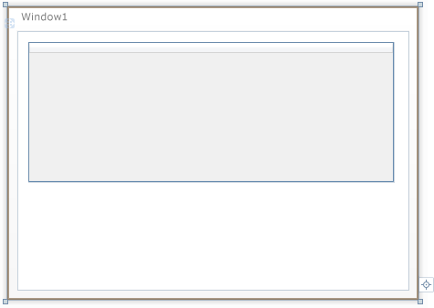

# Пошаговое руководство. Отображение данных из базы данных SQL Server в элементе управления DataGrid
В этом пошаговом руководстве будет выполняться извлечение данных из базы данных SQL Server и отображение их в элементе управления <xref:System.Windows.Controls.DataGrid>.  С помощью Entity Framework ADO.NET создаются классы сущностей, которые представляют данные, а с помощью LINQ пишется запрос, извлекающий указанные данные из класса сущностей.  
  
## Обязательные компоненты  
 Ниже приведены компоненты, необходимые для выполнения данного пошагового руководства.  
  
-   [!INCLUDE[vs_dev11_long](../../../../includes/vs-dev11-long-md.md)].  
  
-   Доступ к работающему экземпляру SQL Server или SQL Server Express с подключенной демонстрационной базой данных AdventureWorksLT2008.  Базу данных AdventureWorksLT2008 можно загрузить с [веб\-сайта CodePlex](http://go.microsoft.com/fwlink/?LinkId=159848).  
  
### Создание классов сущностей  
  
1.  Создайте новый проект приложения WPF на языке Visual Basic или C\# с именем `DataGridSQLExample`.  
  
2.  В обозревателе решений щелкните правой кнопкой мыши проект, переведите указатель на пункт **Добавить** и выберите команду **Создать элемент**.  
  
     Откроется диалоговое окно Добавление нового элемента.  
  
3.  В области установленных шаблонов выберите **Данные**, затем в списке шаблонов выберите **ADO.NET Entity Data Model**.  
  
       
  
4.  Назовите файл `AdventureWorksModel.edmx`, а затем нажмите кнопку **Добавить**.  
  
     Появится мастер модели EDM.  
  
5.  На экране выбора содержимого модели выберите **Создать из базы данных** и нажмите кнопку **Далее**.  
  
       
  
6.  В экране выбора подключения данных предоставьте подключение к базе данных AdventureWorksLT2008.  Дополнительные сведения см. в статье [Диалоговое окно выбора подключения данных \(статья может быть на английском языке\)](http://go.microsoft.com/fwlink/?LinkId=160190).  
  
       
  
7.  Удостоверьтесь, что имя задано как `AdventureWorksLT2008Entities`, и что установлен флажок **Сохранить настройки подключения сущности в App.Config как**, и нажмите кнопку **Далее**.  
  
8.  В экране выбора объектов базы данных разверните узел "Таблицы" и выберите таблицы **Product** и **ProductCategory**.  
  
     Можно создать классы сущностей для всех таблиц; в этом примере извлекаются данные только из этих двух таблиц.  
  
       
  
9. Нажмите кнопку **Готово**.  
  
     Сущности Product и ProductCategory отображаются в конструкторе сущностей.  
  
       
  
### Извлечение и представление данных  
  
1.  Откройте файл MainWindow.xaml.  
  
2.  Установите свойство <xref:System.Windows.FrameworkElement.Width%2A> элемента <xref:System.Windows.Window> в значение 450.  
  
3.  В редакторе XAML добавьте следующий тег <xref:System.Windows.Controls.DataGrid> между тегами `<Grid>` и `</Grid>`, чтобы добавить <xref:System.Windows.Controls.DataGrid> с именем `dataGrid1`.  
  
     [!code-xml[DataGrid_SQL_EF_Walkthrough#3](../../../../samples/snippets/csharp/VS_Snippets_Wpf/DataGrid_SQL_EF_Walkthrough/CS/MainWindow.xaml#3)]  
  
       
  
4.  Выберите <xref:System.Windows.Window>.  
  
5.  С помощью окна свойств или редактора XAML создайте обработчик событий для <xref:System.Windows.Window> с именем `Window_Loaded` для события <xref:System.Windows.FrameworkElement.Loaded>.  Дополнительные сведения см. в разделе [Практическое руководство. Создание простого обработчика событий](http://msdn.microsoft.com/ru-ru/b1456e07-9dec-4354-99cf-18666b64f480).  
  
     Далее приводится код XAML для файла MainWindow.xaml.  
  
    > [!NOTE]
    >  Если используется Visual Basic, замените код `x:Class="DataGridSQLExample.MainWindow"` в первой строке файла MainWindow.xaml кодом `x:Class="MainWindow"`.  
  
     [!code-xml[DataGrid_SQL_EF_Walkthrough#1](../../../../samples/snippets/csharp/VS_Snippets_Wpf/DataGrid_SQL_EF_Walkthrough/CS/MainWindow.xaml#1)]  
  
6.  Откройте файл кода программной части \(MainWindow.xaml.vb или MainWindow.xaml.cs\) для <xref:System.Windows.Window>.  
  
7.  Добавьте следующий код, чтобы извлечь из присоединенных таблиц только указанные значения и установить в качестве значения свойства <xref:System.Windows.Controls.ItemsControl.ItemsSource%2A> элемента управления <xref:System.Windows.Controls.DataGrid> результат запроса.  
  
     [!code-csharp[DataGrid_SQL_EF_Walkthrough#2](../../../../samples/snippets/csharp/VS_Snippets_Wpf/DataGrid_SQL_EF_Walkthrough/CS/MainWindow.xaml.cs#2)]
     [!code-vb[DataGrid_SQL_EF_Walkthrough#2](../../../../samples/snippets/visualbasic/VS_Snippets_Wpf/DataGrid_SQL_EF_Walkthrough/VB/MainWindow.xaml.vb#2)]  
  
8.  Запустите пример.  
  
     Должен появиться элемент управления <xref:System.Windows.Controls.DataGrid>, отображающий данные.  
  
       
  
## Следующие действия  
  
## См. также  
 <xref:System.Windows.Controls.DataGrid>   
 [Инструкции: Получите работу с Entity Framework в приложениях WPF?](http://go.microsoft.com/fwlink/?LinkId=159868)