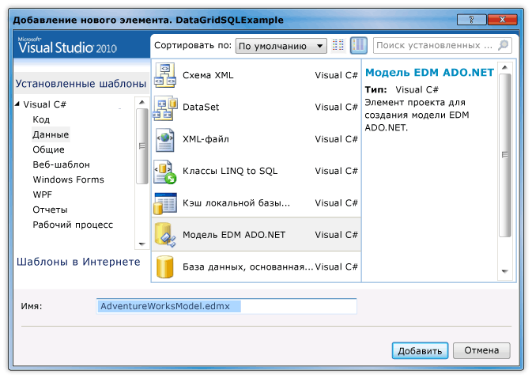

# Пошаговое руководство. Отображение данных из базы данных SQL Server в элементе управления DataGrid
В этом пошаговом руководстве, получения данных из базы данных SQL Server и отображение их в <xref:System.Windows.Controls.DataGrid> элемента управления. Использовать ADO.NET Entity Framework для создания классов сущностей, которые представляют данные, а также написать запрос, извлекающий указанные данные из класса сущностей с помощью LINQ.  
  
## Предварительные требования  
 Ниже приведены компоненты, необходимые для выполнения данного пошагового руководства.  
  
-   [!INCLUDE[vs_dev11_long](../../../../includes/vs-dev11-long-md.md)].  
  
-   Доступ к запущенному экземпляру SQL Server или SQL Server Express с подключенной образца базы данных AdventureWorks, присоединенные к нему. Можно загрузить из базы данных AdventureWorks [GitHub](https://github.com/Microsoft/sql-server-samples/releases).  
  
### Для создания классов сущностей  
  
1.  Создание нового проекта приложения WPF в Visual Basic или C# и назовите его `DataGridSQLExample`.  
  
2.  В обозревателе решений щелкните проект правой кнопкой мыши **добавить**, а затем выберите **новый элемент**.  
  
     Откроется диалоговое окно Добавление нового элемента.  
  
3.  Выберите в области установленные шаблоны **данные** и в списке шаблонов выберите **режим данных ADO.NET Entity**l.  
  
       
  
4.  Назовите файл `AdventureWorksModel.edmx` и нажмите кнопку **добавить**.  
  
     Появится мастер модели EDM.  
  
5.  В окне Выбор содержимого модели выберите **создать из базы данных** и нажмите кнопку **Далее**.  
  
       
  
6.  На экране «Выбор подключения базы данных» укажите подключение к базе данных AdventureWorksLT2008. Дополнительные сведения см. в разделе [выберите ваш данных диалоговое окно подключения](http://go.microsoft.com/fwlink/?LinkId=160190).  
  
       
  
7.  Убедитесь, что имя указано `AdventureWorksLT2008Entities` и что **сохранить настройки подключения сущности в App.Config как** флажок установлен и нажмите кнопку **Далее**.  
  
8.  На экране Выбор объектов базы данных, разверните узел таблицы и выберите **продукта** и **ProductCategory** таблиц.  
  
     Можно создать классы сущностей для всех таблиц. Однако в этом примере извлекаются данные только из этих двух таблиц.  
  
       
  
9. Нажмите кнопку **Готово**.  
  
     Сущности Product и ProductCategory, отображаются в конструкторе сущностей.  
  
       
  
### Для получения и представления данных  
  
1.  Откройте файл MainWindow.xaml.  
  
2.  Задать <xref:System.Windows.FrameworkElement.Width%2A> свойство <xref:System.Windows.Window> в значение 450.  
  
3.  В редакторе XAML добавьте следующие <xref:System.Windows.Controls.DataGrid> тег между `<Grid>` и `</Grid>` тегов, чтобы добавить <xref:System.Windows.Controls.DataGrid> с именем `dataGrid1`.  
  
     [!code-xaml[DataGrid_SQL_EF_Walkthrough#3](../../../../samples/snippets/csharp/VS_Snippets_Wpf/DataGrid_SQL_EF_Walkthrough/CS/MainWindow.xaml#3)]  
  
       
  
4.  Выберите <xref:System.Windows.Window>.  
  
5.  С помощью окна свойств или редактора XAML создайте обработчик событий для <xref:System.Windows.Window> с именем `Window_Loaded` для <xref:System.Windows.FrameworkElement.Loaded> события. Дополнительные сведения см. в разделе [как: создание простого обработчика событий](http://msdn.microsoft.com/library/b1456e07-9dec-4354-99cf-18666b64f480).  
  
     Ниже показан код XAML для файла MainWindow.xaml.  
  
    > [!NOTE]
    >  При использовании Visual Basic в первой строке файла MainWindow.XAML замените `x:Class="DataGridSQLExample.MainWindow"` с `x:Class="MainWindow"`.  
  
     [!code-xaml[DataGrid_SQL_EF_Walkthrough#1](../../../../samples/snippets/csharp/VS_Snippets_Wpf/DataGrid_SQL_EF_Walkthrough/CS/MainWindow.xaml#1)]  
  
6.  Откройте файл кода (файл MainWindow.xaml.vb или MainWindow.xaml.cs) для <xref:System.Windows.Window>.  
  
7.  Добавьте следующий код для извлечения только конкретных значений из соединяемых таблиц и установки <xref:System.Windows.Controls.ItemsControl.ItemsSource%2A> свойство <xref:System.Windows.Controls.DataGrid> к результатам запроса.  
  
     [!code-csharp[DataGrid_SQL_EF_Walkthrough#2](../../../../samples/snippets/csharp/VS_Snippets_Wpf/DataGrid_SQL_EF_Walkthrough/CS/MainWindow.xaml.cs#2)]
     [!code-vb[DataGrid_SQL_EF_Walkthrough#2](../../../../samples/snippets/visualbasic/VS_Snippets_Wpf/DataGrid_SQL_EF_Walkthrough/VB/MainWindow.xaml.vb#2)]  
  
8.  Запустите пример.  
  
     Вы увидите <xref:System.Windows.Controls.DataGrid> , отображающий данные.  
  
       
  
## Следующие шаги  
  
## См. также  
 <xref:System.Windows.Controls.DataGrid>  
 [Как получить работу I: с Entity Framework в приложениях WPF?](http://go.microsoft.com/fwlink/?LinkId=159868)
