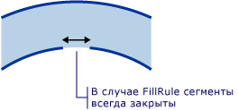

# Практическое руководство. Управление заливкой составных фигур
<xref:System.Windows.Media.GeometryGroup.FillRule%2A> Свойство <xref:System.Windows.Media.GeometryGroup> или <xref:System.Windows.Media.PathGeometry>, указывает «правило», использующий составные фигуры, чтобы определить, является ли заданная точка частью геометрии. Существует два возможных значения <xref:System.Windows.Media.FillRule>: <xref:System.Windows.Media.FillRule.EvenOdd> и <xref:System.Windows.Media.FillRule.Nonzero>. Следующие разделы описывают использование этих двух правил.  
  
 **EvenOdd:** правило, определяющее, находится ли точка в области заполнения, с помощью рисования луча от этой точки до бесконечности в любом направлении и подсчета числа сегментов пути в пределах заданной фигуры, которые пересекает луч. Если это число нечетное, точка находится внутри; если четное — точка находится снаружи.  
  
 Например, приведенный ниже код XAML создает составного фигуру, состоящую из ряда концентрических колец (цель) с <xref:System.Windows.Media.GeometryGroup.FillRule%2A> значение <xref:System.Windows.Media.FillRule.EvenOdd>.  
  
 [!code-xaml[GeometriesMiscSnippets_snip#FillRuleEvenOddValue](../../../../samples/snippets/xaml/VS_Snippets_Wpf/GeometriesMiscSnippets_snip/XAML/FillRuleExample.xaml#fillruleevenoddvalue)]  
  
 На следующем рисунке показана фигура, созданная в предыдущем примере.  
  
   
  
 Обратите внимание, что на приведенном выше рисунке центр и третье кольцо не заполнены. Это потому, что луч, нарисованный из любой точки в одном из этих двух колец проходит через четное число сегментов. См. рисунок ниже:  
  
   
  
 **NonZero:** правило, которое определяет, находится ли точка в области заполнения пути, с помощью рисования луча от этой точки до бесконечности в любом направлении и проверкой мест, в которых сегмент фигуры пересекает луч. Начиная с нуля, добавляется единица каждый раз, когда сегмент пересекает луч слева направо, и вычитается единица каждый раз, когда сегмент пересекает луч справа налево. Если после подсчета пересечений результат равен нулю, то точка находится снаружи пути. В противном случае — она находится внутри.  
  
 [!code-xaml[GeometriesMiscSnippets_snip#FillRuleNonZeroValueEllipseGeometry](../../../../samples/snippets/xaml/VS_Snippets_Wpf/GeometriesMiscSnippets_snip/XAML/FillRuleExample.xaml#fillrulenonzerovalueellipsegeometry)]  
  
 В примере выше значение <xref:System.Windows.Media.FillRule.Nonzero> для <xref:System.Windows.Media.GeometryGroup.FillRule%2A> в результате дает ниже:  
  
   
  
 Как можно видеть, все кольца заполнены. Это связано с тем, что все сегменты идут в одном направлении и поэтому луч, рисуемый из любой точки, будет пересекать один или несколько сегментов и сумма пересечений не будет равна нулю. Например, на следующем рисунке красные стрелки обозначают направление рисования сегментов, а белая стрелка показывает произвольный луч, идущий от точки во внутреннем кольце. Начиная с нуля, для каждого сегмента, который пересекает луч, значение 1 добавляется, так как сегмент пересекает луч слева направо.  
  
   
  
 Для лучшей демонстрации поведения <xref:System.Windows.Media.FillRule.Nonzero> требуется правило более сложные фигуры с сегментами в другом направлении. Приведенный ниже код XAML создает фигуру, аналогичную аналогичен предыдущему примеру, за исключением того, что она создана с <xref:System.Windows.Media.PathGeometry> а затем <xref:System.Windows.Media.EllipseGeometry> создает четыре концентрических дуги а не полностью замкнутые концентрических окружностей.  
  
 [!code-xaml[GeometriesMiscSnippets_snip#FillRuleNonZeroValuePathGeometry](../../../../samples/snippets/xaml/VS_Snippets_Wpf/GeometriesMiscSnippets_snip/XAML/FillRuleExample.xaml#fillrulenonzerovaluepathgeometry)]  
  
 На следующем рисунке показана фигура, созданная в предыдущем примере.  
  
   
  
 Обратите внимание, что третья дуга от центра не заполнена. На приведенном ниже рисунке показана причина этого. На рисунке красные стрелки обозначают направление, в котором рисуются сегменты. Две белые стрелки показывают два произвольных луча, которые выходят из точки в «незаполненной» области. Как видно из рисунка, сумма значений для луча, пересекающего сегменты в пути, равна нулю. Как указано выше, сумма ноль означает, что точка не является частью геометрии (не является частью заливки), а сумма, которая *не равна* нулю, в том числе отрицательное значение, является частью геометрии.  
  
   
  
 **Примечание:** в целях <xref:System.Windows.Media.FillRule>, все фигуры считаются замкнутыми. Если в сегменте есть разрыв, нарисуйте воображаемую линию, чтобы его закрыть. В приведенном выше примере имеются небольшие разрывы в кольцах. Учитывая это, можно предположить, что луч, проходящий через разрыв, даст другой результат, чем луч, проходящий в другом направлении. Ниже приведен увеличенный рисунок одного из этих разрывов и «мнимой сегмент» (сегмент, который рисуется для применения <xref:System.Windows.Media.FillRule>), закрывает его.  
  
   
  
## Пример  
  
## См. также  
 [Создание составной фигуры](../../../../docs/framework/wpf/graphics-multimedia/how-to-create-a-composite-shape.md)  
 [Общие сведения о классе Geometry](../../../../docs/framework/wpf/graphics-multimedia/geometry-overview.md)
