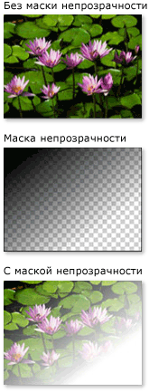
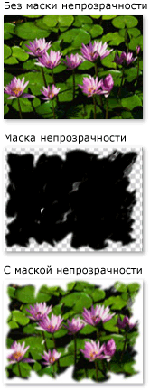

# Общие сведения о масках непрозрачности
Маски непрозрачности позволяют делать части элемента или визуального элемента прозрачными или частично прозрачными. Создание маски непрозрачности, применить <xref:System.Windows.Media.Brush> для <xref:System.Windows.UIElement.OpacityMask%2A> свойства элемента или <xref:System.Windows.Media.Visual>.  Кисть сопоставляется с элементом или визуальным элементом, а значение непрозрачности каждого пикселя кисти используется для определения результирующей непрозрачности каждого соответствующего пикселя элемента или визуального элемента.  
  
   
## Предварительные требования  
 Этот обзор предполагает, что вы знакомы с <xref:System.Windows.Media.Brush> объектов. Общие сведения об использовании кистей см. в разделе [Общие сведения о закрашивании сплошным цветом и градиентом](../../../../docs/framework/wpf/graphics-multimedia/painting-with-solid-colors-and-gradients-overview.md). Сведения о <xref:System.Windows.Media.ImageBrush> и <xref:System.Windows.Media.DrawingBrush>, в разделе [Рисование с помощью изображения, рисунки и визуальные элементы](../../../../docs/framework/wpf/graphics-multimedia/painting-with-images-drawings-and-visuals.md).  
  
   
## Создание визуальных эффектов с помощью маски непрозрачности  
 Маска непрозрачности работает путем сопоставления своего содержимого с элементом или визуальным элементом. Затем используются альфа-канал каждой из точек кисти для определения результирующей непрозрачности элемента или визуального элемента соответствующих точек. Фактический цвет кисти игнорируется. Если данная часть кисти является прозрачной, соответствующая часть элемента или визуального элемента тоже становится прозрачной. Если данная часть кисти является непрозрачной, непрозрачность соответствующей части элемента или визуального элемента не меняется. Непрозрачность, заданная маской непрозрачности, объединяется со всеми параметрами непрозрачности, заданными в элементе или визуальном элементе. Например, если элемент является непрозрачным на 25 процентов и применяется маска непрозрачности с диапазоном от полной непрозрачности до полной прозрачности, в результате получится элемент с диапазоном от коэффициента непрозрачности 25 процентов до полной прозрачности.  
  
> [!NOTE]
>  Хотя примеры в этом обзоре демонстрируют использование масок непрозрачности на элементах изображения, маски непрозрачности может применяться к любому элементу или <xref:System.Windows.Media.Visual>, в том числе панелей и элементов управления.  
  
 Маски непрозрачности используются для создания интересных визуальных эффектов, таких как изображения или кнопки, которые исчезают из виду, для добавления текстур элементов или для объединения градиентов с целью создания стеклянных поверхностей. На следующем рисунке показано использование маски непрозрачности. Клетчатый фон используется для отображения прозрачных частей маски.  
  
   
Пример использования маски непрозрачности  
  
   
## Создание маски непрозрачности  
 Создание маски непрозрачности, создайте <xref:System.Windows.Media.Brush> и примените его к <xref:System.Windows.UIElement.OpacityMask%2A> свойства элемента или визуального элемента. Можно использовать любой тип <xref:System.Windows.Media.Brush> как маски непрозрачности.  
  
-   <xref:System.Windows.Media.LinearGradientBrush>, <xref:System.Windows.Media.RadialGradientBrush>: Используются, чтобы сделать элемент или visual исчезания из представления.  
  
     На следующем рисунке показана <xref:System.Windows.Media.LinearGradientBrush> используется в качестве маски непрозрачности.  
  
       
Пример применения маски непрозрачности LinearGradientBrush  
  
-   <xref:System.Windows.Media.ImageBrush>: Используется для создания текстуры и эффектов гладких или оборванных краев.  
  
     На следующем рисунке показана <xref:System.Windows.Media.ImageBrush> используется в качестве маски непрозрачности.  
  
       
Пример применения маски непрозрачности LinearGradientBrush  
  
-   <xref:System.Windows.Media.DrawingBrush>: Используется для создания сложных масок непрозрачности из шаблонов фигур, изображений и градиентов.  
  
     На следующем рисунке показана <xref:System.Windows.Media.DrawingBrush> используется в качестве маски непрозрачности.  
  
       
Пример применения маски непрозрачности DrawingBrush  
  
 Градиентные кисти (<xref:System.Windows.Media.LinearGradientBrush> и <xref:System.Windows.Media.RadialGradientBrush>) особенно хорошо подходят для использования в качестве маски непрозрачности. Поскольку <xref:System.Windows.Media.SolidColorBrush> заполняет область одинаковым цветом, они делают низкой непрозрачности маскирует; с помощью <xref:System.Windows.Media.SolidColorBrush> эквивалентно установке свойства элемента или визуального элемента <xref:System.Windows.UIElement.OpacityMask%2A> свойство.  
  
   
## Использование градиента в качестве маски непрозрачности  
 Чтобы создать градиентную заливку, необходимо указать два или несколько ограничений градиента. Каждое ограничение градиента содержит описание цвета и положения. (Дополнительные сведения о создании и использовании градиентов см. в разделе [Общие сведения о закрашивании сплошным цветом и градиентом](../../../../docs/framework/wpf/graphics-multimedia/painting-with-solid-colors-and-gradients-overview.md).) Использование градиента аналогично использованию маски непрозрачности за исключением того, что вместо смешения цветов, градиент маски непрозрачности смешивает значения альфа-канала. Поэтому фактический цвет содержимого градиента не имеет значения. Имеет значение только альфа-канал или непрозрачность каждого цвета. Пример.  
  
 [!code-xaml[OpacityMasksSnippet#LinearGradientOpacityMaskonImage](../../../../samples/snippets/csharp/VS_Snippets_Wpf/OpacityMasksSnippet/CS/GradientBrushExample.xaml#lineargradientopacitymaskonimage)]  
  
   
## Задание ограничений градиента для маски непрозрачности  
 В предыдущем примере системные цвета <xref:System.Windows.Media.Colors.Black%2A> используется как начальный цвет градиента. Поскольку все цвета в <xref:System.Windows.Media.Colors> класса, за исключением <xref:System.Windows.Media.Colors.Transparent%2A>, являются полностью непрозрачными, они могут использоваться чтобы просто определить начальный цвет для маски непрозрачности градиента.  
  
 Для дополнительный контроль над альфа-значений при определении маски непрозрачности можно указать альфа-канал цветов с помощью [!INCLUDE[TLA#tla_argb](../../../../includes/tlasharptla-argb-md.md)] шестнадцатеричного формата в разметке или с помощью <xref:System.Windows.Media.Color.FromScRgb%2A?displayProperty=nameWithType> метод.  
  
   
### Задание непрозрачности цвета в XAML  
 В [!INCLUDE[TLA#tla_xaml](../../../../includes/tlasharptla-xaml-md.md)] можно использовать шестнадцатеричный формат [!INCLUDE[TLA2#tla_argb](../../../../includes/tla2sharptla-argb-md.md)] для указания непрозрачности отдельных цветов. В шестнадцатеричном формате [!INCLUDE[TLA2#tla_argb](../../../../includes/tla2sharptla-argb-md.md)] используется следующий синтаксис.  
  
 `#` **aa** *rrggbb*  
  
 Здесь *aa* — двузначное шестнадцатеричное значение, используемое для указания непрозрачности цвета. *rr*, *gg* и *bb* — двузначные шестнадцатеричные значения, используемые для указания насыщенности красного, зеленого и синего цветов. Шестнадцатеричная цифра может принимать значения от 0 до F (сначала цифры от 0 до 9, затем буквы от A до F). Наименьшее значение — 0, наибольшее — F. Альфа-значение 00 задает полностью прозрачный цвет, а альфа-значение FF — полностью непрозрачный цвет.  В следующем примере используется шестнадцатеричный формат [!INCLUDE[TLA2#tla_argb](../../../../includes/tla2sharptla-argb-md.md)] для задания двух цветов. Первый — полностью непрозрачный, второй — полностью прозрачный.  
  
 [!code-xaml[OpacityMasksSnippet#AARRGGBBValueonOpacityMask](../../../../samples/snippets/csharp/VS_Snippets_Wpf/OpacityMasksSnippet/CS/GradientBrushExample.xaml#aarrggbbvalueonopacitymask)]  
  
   
## Использование изображения в качестве маски непрозрачности  
 Изображения также могут использоваться в качестве масок непрозрачности. На следующем рисунке показан пример. Клетчатый фон используется для отображения прозрачных частей маски.  
  
   
Пример использования маски непрозрачности  
  
 Чтобы использовать изображение в качестве маски непрозрачности, используйте <xref:System.Windows.Media.ImageBrush> для включения изображения. При создании изображения для использования в качестве маски непрозрачности сохраните рисунок в формате, поддерживающем несколько уровней прозрачности, например [!INCLUDE[TLA#tla_png](../../../../includes/tlasharptla-png-md.md)]. В следующем примере показан код, используемый для создания предыдущей иллюстрации.  
  
 [!code-xaml[OpacityMasksSnippet#UIElementOpacityMask](../../../../samples/snippets/csharp/VS_Snippets_Wpf/OpacityMasksSnippet/CS/ImageBrushExample.xaml#uielementopacitymask)]  
  
   
### Использование мозаичного изображения в качестве маски непрозрачности  
 В следующем примере используется тот же образ с другим <xref:System.Windows.Media.ImageBrush>, но возможности заполнения кисти используются для создания мозаичных элементов изображения 50 пикселей в квадрате.  
  
 [!code-xaml[OpacityMasksSnippet#TiledImageasOpacityMask](../../../../samples/snippets/csharp/VS_Snippets_Wpf/OpacityMasksSnippet/CS/ImageBrushExample.xaml#tiledimageasopacitymask)]  
  
   
## Создание маски непрозрачности из рисунка  
 Рисунки могут быть использованы как маски непрозрачности. Фигуры, содержащиеся в рисунке, могут быть сами заполнены градиентом, сплошным цветом, изображением или даже другим рисунком. На следующем рисунке приведен пример рисунка, используемого в качестве маски непрозрачности. Клетчатый фон используется для отображения прозрачных частей маски.  
  
   
Пример применения маски непрозрачности DrawingBrush  
  
 Для использования рисунка в качестве маски непрозрачности, используйте <xref:System.Windows.Media.DrawingBrush> для хранения рисунка. В следующем примере показан код, используемый для создания предыдущей иллюстрации.  
  
 [!code-xaml[OpacityMasksSnippet#OpacityMaskfromDrawing](../../../../samples/snippets/csharp/VS_Snippets_Wpf/OpacityMasksSnippet/CS/DrawingBrushExample.xaml#opacitymaskfromdrawing)]  
  
   
### Использование мозаичного рисунка в качестве маски непрозрачности  
 Как <xref:System.Windows.Media.ImageBrush>, <xref:System.Windows.Media.DrawingBrush> можно сделать для мозаичного заполнения его рисования. В следующем примере кисть рисунка используется для создания мозаичной маски непрозрачности.  
  
 [!code-xaml[OpacityMasksSnippet#TiledDrawingasOpacityMask](../../../../samples/snippets/csharp/VS_Snippets_Wpf/OpacityMasksSnippet/CS/DrawingBrushExample.xaml#tileddrawingasopacitymask)]  
  
## См. также  
 [Заполнение с использованием изображений, рисунков и визуальных элементов](../../../../docs/framework/wpf/graphics-multimedia/painting-with-images-drawings-and-visuals.md)  
 [Общие сведения о закраске сплошным цветом и градиентом](../../../../docs/framework/wpf/graphics-multimedia/painting-with-solid-colors-and-gradients-overview.md)
