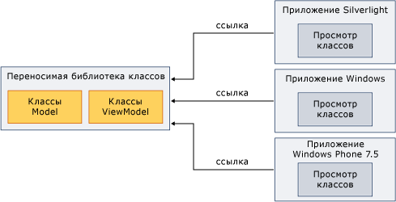

# Использование переносимой библиотеки классов с шаблоном "модель-представление-модель представления"
Можно использовать .NET Framework [переносимой библиотеки классов](../../../docs/standard/cross-platform/cross-platform-development-with-the-portable-class-library.md) для реализации шаблона Model-View-View Model (MVVM) и совместного использования сборок на нескольких платформах.  
  
 MVVM — это шаблон приложения, который изолирует интерфейс пользователя от основной бизнес-логики. Можно реализовать классы модели и модели представления в проекте [!INCLUDE[net_portable](../../../includes/net-portable-md.md)] в [!INCLUDE[vs_dev11_long](../../../includes/vs-dev11-long-md.md)], а затем создать представления, которые учитывают особенности разных платформ. Такой подход позволяет создавать модель и бизнес-логику данных только один раз и использовать этот код в платформе .NET Framework, приложениях Silverlight, Windows Phone и [!INCLUDE[win8_appname_long](../../../includes/win8-appname-long-md.md)], как показано на следующей иллюстрации.  
  
   
  
 В этом разделе не предоставляет общие сведения о шаблоне MVVM. Он только предоставляет сведения об использовании [!INCLUDE[net_portable](../../../includes/net-portable-md.md)] для реализации MVVM. Дополнительные сведения о MVVM см. в разделе [краткое руководство MVVM](https://msdn.microsoft.com/library/gg430869(v=PandP.40).aspx).  
  
## Классы, поддерживающие MVVM  
 При разработке [!INCLUDE[net_v45](../../../includes/net-v45-md.md)], [!INCLUDE[net_win8_profile](../../../includes/net-win8-profile-md.md)], Silverlight или Windows Phone 7.5 для вашего [!INCLUDE[net_portable](../../../includes/net-portable-md.md)] проекта, следующие классы доступны для реализации шаблона MVVM:  
  
-   Класс <xref:System.Collections.ObjectModel.ObservableCollection%601?displayProperty=nameWithType>  
  
-   Класс <xref:System.Collections.ObjectModel.ReadOnlyObservableCollection%601?displayProperty=nameWithType>  
  
-   Класс <xref:System.Collections.Specialized.INotifyCollectionChanged?displayProperty=nameWithType>  
  
-   Класс <xref:System.Collections.Specialized.NotifyCollectionChangedAction?displayProperty=nameWithType>  
  
-   Класс <xref:System.Collections.Specialized.NotifyCollectionChangedEventArgs?displayProperty=nameWithType>  
  
-   Класс <xref:System.Collections.Specialized.NotifyCollectionChangedEventHandler?displayProperty=nameWithType>  
  
-   Класс <xref:System.ComponentModel.DataErrorsChangedEventArgs?displayProperty=nameWithType>  
  
-   Класс <xref:System.ComponentModel.INotifyDataErrorInfo?displayProperty=nameWithType>  
  
-   Класс <xref:System.ComponentModel.INotifyPropertyChanged?displayProperty=nameWithType>  
  
-   Класс <xref:System.Windows.Input.ICommand?displayProperty=nameWithType>  
  
-   Все классы в <xref:System.ComponentModel.DataAnnotations?displayProperty=nameWithType> пространства имен  
  
## Реализация MVVM  
 Чтобы реализовать MVVM, обычно создаются модели и модели представления в [!INCLUDE[net_portable](../../../includes/net-portable-md.md)] проект, поскольку [!INCLUDE[net_portable](../../../includes/net-portable-md.md)] Непереносимый проект не может ссылаться на проект. Модели и модели представления может быть в том же проекте или в виде отдельных проектов. Если вы используете отдельные проекты, добавьте ссылку из проекта модели представления в проект модели.  
  
 После компиляции модели и просматривать проекты модели, можно ссылаться на эти сборки в приложении, которая содержит представление. Если представление взаимодействует только с помощью модели представления, имеется ссылка на сборку, содержащую модель представления.  
  
### Модель  
 В следующем примере показано упрощенная модель класс, который может находиться в [!INCLUDE[net_portable](../../../includes/net-portable-md.md)] проекта.  
  
 [!code-csharp[PortableClassLibraryMVVM#1](../../../samples/snippets/csharp/VS_Snippets_CLR/portableclasslibrarymvvm/cs/customer.cs#1)]
 [!code-vb[PortableClassLibraryMVVM#1](../../../samples/snippets/visualbasic/VS_Snippets_CLR/portableclasslibrarymvvm/vb/customer.vb#1)]  
  
 В следующем примере показано простой способ заполнения, получения и обновления данных в [!INCLUDE[net_portable](../../../includes/net-portable-md.md)] проекта. В реальном приложении будет получать данные из источника, например службы Windows Communication Foundation (WCF).  
  
 [!code-csharp[PortableClassLibraryMVVM#2](../../../samples/snippets/csharp/VS_Snippets_CLR/portableclasslibrarymvvm/cs/customerrepository.cs#2)]
 [!code-vb[PortableClassLibraryMVVM#2](../../../samples/snippets/visualbasic/VS_Snippets_CLR/portableclasslibrarymvvm/vb/customerrepository.vb#2)]  
  
### Модель представления  
 Базовый класс для представления моделей часто добавляется при реализации шаблона MVVM. В следующем примере базовый класс.  
  
 [!code-csharp[PortableClassLibraryMVVM#3](../../../samples/snippets/csharp/VS_Snippets_CLR/portableclasslibrarymvvm/cs/viewmodelbase.cs#3)]
 [!code-vb[PortableClassLibraryMVVM#3](../../../samples/snippets/visualbasic/VS_Snippets_CLR/portableclasslibrarymvvm/vb/viewmodelbase.vb#3)]  
  
 Реализация <xref:System.Windows.Input.ICommand> часто используется интерфейс с шаблоном MVVM. В следующем примере показана реализация интерфейса <xref:System.Windows.Input.ICommand>.  
  
 [!code-csharp[PortableClassLibraryMVVM#4](../../../samples/snippets/csharp/VS_Snippets_CLR/portableclasslibrarymvvm/cs/relaycommand.cs#4)]
 [!code-vb[PortableClassLibraryMVVM#4](../../../samples/snippets/visualbasic/VS_Snippets_CLR/portableclasslibrarymvvm/vb/relaycommand.vb#4)]  
  
 В следующем примере показано упрощенное представление модели.  
  
 [!code-csharp[PortableClassLibraryMVVM#5](../../../samples/snippets/csharp/VS_Snippets_CLR/portableclasslibrarymvvm/cs/mainpageviewmodel.cs#5)]
 [!code-vb[PortableClassLibraryMVVM#5](../../../samples/snippets/visualbasic/VS_Snippets_CLR/portableclasslibrarymvvm/vb/customerviewmodel.vb#5)]  
  
### Просмотр  
 Из [!INCLUDE[net_v45](../../../includes/net-v45-md.md)] приложения, [!INCLUDE[win8_appname_long](../../../includes/win8-appname-long-md.md)] приложения, приложения Silverlight или приложения Windows Phone 7.5, могут ссылаться на сборку, содержащую проекты модели и представления модели.  Затем создается представление, которое взаимодействует с модели представления. В следующем примере показано упрощенное приложения Windows Presentation Foundation (WPF), который получает и обновляет данные из модели представления. Вы можете создать сходные представления в Silverlight, Windows Phone или [!INCLUDE[win8_appname_long](../../../includes/win8-appname-long-md.md)] приложений.  
  
 [!code-xaml[PortableClassLibraryMVVM#6](../../../samples/snippets/csharp/VS_Snippets_CLR/portableclasslibrarymvvm/cs/mainwindow.xaml#6)]  
  
## См. также  
 [Переносимая библиотека классов](../../../docs/standard/cross-platform/cross-platform-development-with-the-portable-class-library.md)
