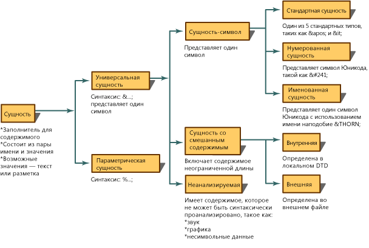

# <a name="reading-entity-declarations-and-entity-references-into-the-dom"></a>Считывание объявлений сущностей и ссылок на сущности в DOM
Сущность является декларацией, определяющей имя, которое будет использоваться в XML-документе вместо содержимого или разметки. Сущность состоит из двух частей. Во-первых, в декларации сущности необходимо связать имя с заменяющим его содержимым. Декларация сущности создается с помощью синтаксиса `<!ENTITY name "value">` определения DTD или схемы XML. Во-вторых, определенное в декларации сущности имя впоследствии используется в XML-документе. При использовании в XML-документе оно называется ссылкой на сущность. Например, следующая декларация сущности определяет сущность с именем `publisher`, связанную с содержимым «Microsoft Press».  
  
```xml  
<!ENTITY publisher "Microsoft Press">  
```  
  
 В следующем примере показано использование декларации сущности в XML в качестве ссылки на сущность.  
  
```xml  
<author>Fred</author>  
<pubinfo>Published by &publisher;</pubinfo>  
```  
  
 Некоторые средства синтаксического анализа автоматически раскрывают сущности при загрузке документа в память. Поэтому, когда XML-документ считывается в память, декларации сущностей запоминаются и сохраняются. Если средство синтаксического анализа впоследствии встречает символы `&;`, определяющие ссылку на общую сущность, оно ищет это имя в таблице деклараций сущностей. Ссылка `&publisher;` заменяется содержимым, которое она представляет. Используя следующий XML-код,  
  
```xml  
<author>Fred</author>  
<pubinfo>Published by &publisher;</pubinfo>  
```  
  
 раскрывает ссылку на сущность и заменяет `&publisher;` содержимым Microsoft Press, формируя следующий расширенный XML.  
  
 **Вывод**  
  
```xml  
<author>Fred</author>  
<pubinfo>Published by Microsoft Press</pubinfo>  
```  
  
 Существует много типов сущностей. На следующей схеме показана классификация типов сущности и терминология.  
  
   
  
 По умолчанию реализация платформы Microsoft .NET Framework модель объектов XML документа (DOM) является сохранение ссылки на сущности и не раскрывает их при загрузке XML. Это означает, как при загрузке документа в DOM **XmlEntityReference** узел, содержащий ссылочную переменную `&publisher;` будет создана, с дочерними узлами, представляющими содержимое сущности, объявленной в DTD.  
  
 С помощью `<!ENTITY publisher "Microsoft Press">` на следующей схеме показана декларация сущности **XmlEntity** и **XmlText** узлы, созданные на основе этой декларации.  
  
   
  
 Будут ли раскрываться ссылки на сущности или нет - зависит от вида узлов, создаваемых в дереве модели DOM в памяти. Различие в формируемых узлов объясняется в разделах [ссылки на сущности сохраняются](../../../../docs/standard/data/xml/entity-references-are-preserved.md) и [, ссылки на сущности раскрываются и не сохраняются](../../../../docs/standard/data/xml/entity-references-are-expanded-and-not-preserved.md).  
  
## <a name="see-also"></a>См. также  
 [Модель объектов XML-документов (DOM)](../../../../docs/standard/data/xml/xml-document-object-model-dom.md)
